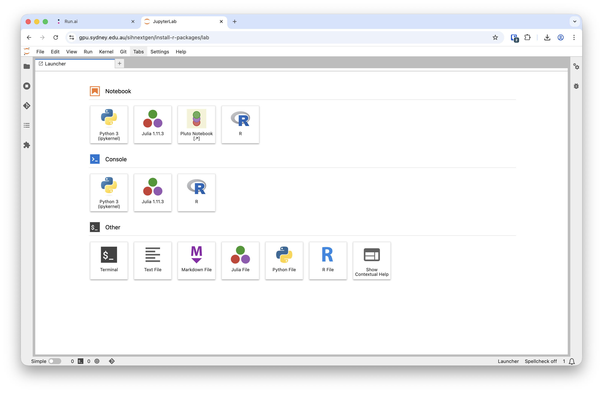
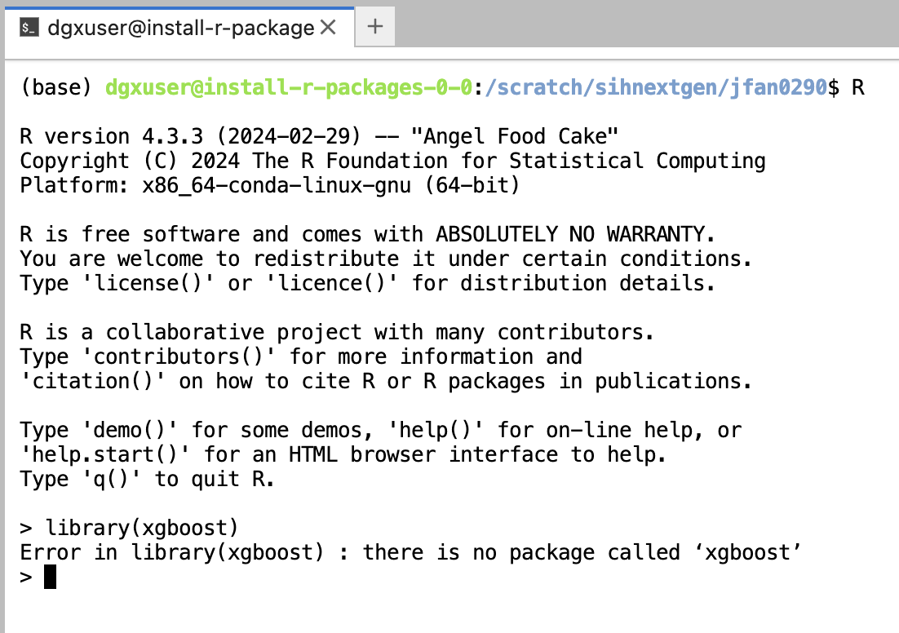
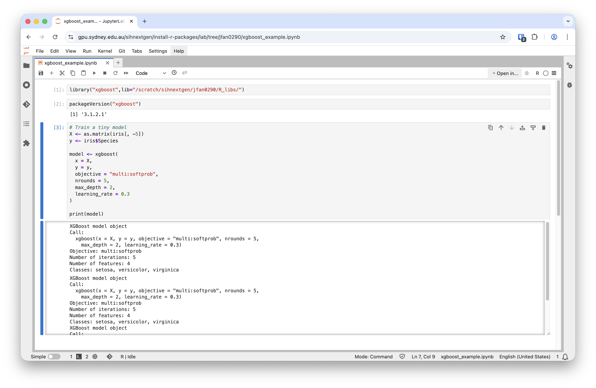

# Tutorial: Self-installing R packages
In this tutorial, we will demonstrate how to install R packages in your Run:AI workload. This is particularly useful when you need specific packages that are not included in the pre-installed image.

## Create a Run:AI Jupyter Lab workload
Follow the instructions in the [Jupyter Lab tutorial](./jupyter_tutorial.md) to create a new workload in Run:AI and connect to the Jupyter Lab interface. You will see the following landing page when the workload is created successfully:



There are three ways of accessing R in this default Jupyter Lab environment:

- R notebook
- R Console
- Terminal

In this tutorial, we will demonstrate how to use the Terminal application to install R packages.

## Install R packages via Terminal
1. Open a new Terminal window by clicking on the Terminal icon in the Jupyter Lab interface.
2. Create a directory in your PVC to store any newly installed R packages. This ensures that the packages persist across sessions and are not removed after the workload is stopped running. 

   You can do this by creating a subdirectory in `/scratch/${RUNAI_PROJECT}`. For example:
   ```bash
   mkdir -p /scratch/${RUNAI_PROJECT}/my_username/R_libs
   ```
   which will create a directory named `R_libs` in the project PVC. You may want to change `my_username` to your own username (*e.g.*, your unikey) or preferred directory name.
3. Set the `R_LIBS_USER` environment variable to point to this new directory.
   ```bash
   export R_LIBS_USER=/scratch/${RUNAI_PROJECT}/my_username/R_libs
   ```
4. Start R by executing the command `R` in the terminal.
5. Check if the libary has already been installed in the image. You can either run
   ```R
   installed.packages()
   ```
   to print out the full list of installed packages, or try loading the package using
   ```R
   library(package)
   ```
   You need to replace `package` with the name of the package you want to check. If the package is not installed, you will receive an error message:

   {width=60% fig-align="left"}
5. Install the desired R package using the `install.packages()` function. For example:
   ```R
   install.packages("xgboost", repos="http://cran.ms.unimelb.edu.au/")
   ```
   This command will download and install the `xgboost` package into the directory specified by `R_LIBS_USER`.

## Verify the installation
You can verify the installation by loading the package in R:
```R
library("xgboost")
```
You can also use the libary in an R notebook or R console by setting the `lib` variable (*e.g.*, `lib="/scratch/sihnextgen/jfan0290/R_libs"`) when loading the library:

