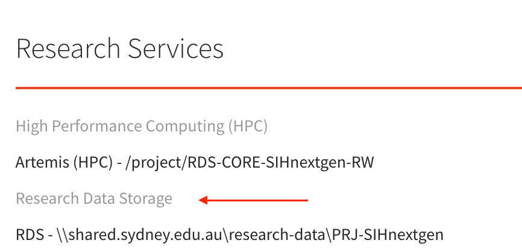
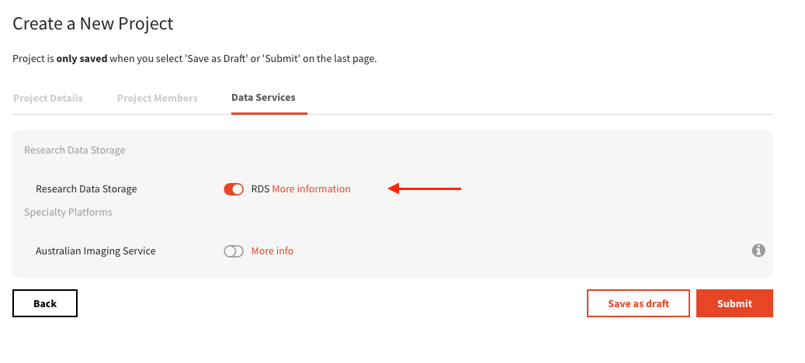

# Accessing the SIH GPU Cluster

Early access to the GPU Cluster is now available. Please follow instructions on [this page](https://sydneyuni.atlassian.net/wiki/spaces/RC/pages/3579674625/GPU+Cluster#Sydney-GPU-Cluster---Early-access-available) to submit your request.

Information that you will be asked to provide in the access request form includes:

- **DashR Research Project Shortcode**: Please log in to the university's [Researcher Dashboard (DashR)](https://dashr.sydney.edu.au/projects), click on the project you intend to work on, and locate the "Project code". This is essential for linking your compute usage to the correct research allocation. ***All existing members of the DashR project*** will automatically gain access to the GPU Cluster once the request is approved. The Chief Investigator or other project administrators can manage project membership via the DashR portal, including adding new users or removing users that no longer need acccess to the cluster under this project.

  :::{.callout-important}
  Please make sure RDS is enabled for the selected DashR project. For existing projects, you can confirm this by navigating to the "Resources Services" section and checking if "Research Data Storage" is listed as an active service:
  {width=60% fig-align="left"}

  If you want to create a separate new project for managing cluster access, ensure that you select "Research Data Storage" when creating the project.
  {fig-align="left"}

  :::

- **Billing Code**: This should be the internal billing code associated with your project or department. If you are unsure, please consult your supervisor or finance administrator.

You will receive an email confirmation once your access has been granted, along with the project code and further instructions on how to connect to the SIH GPU Cluster.

:::{.callout-note}
**Work in Progress**: Long-term project provisioning and cluster access will be streamlined and centrally managed on DashR.
:::