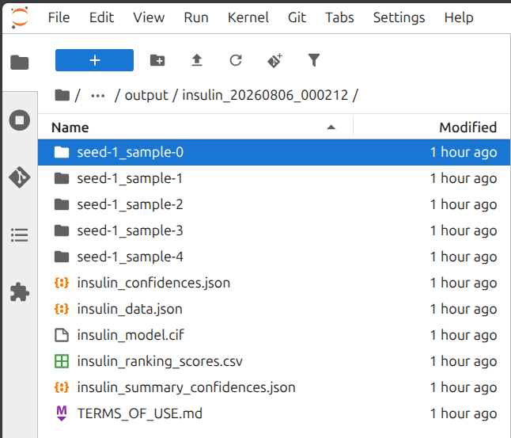
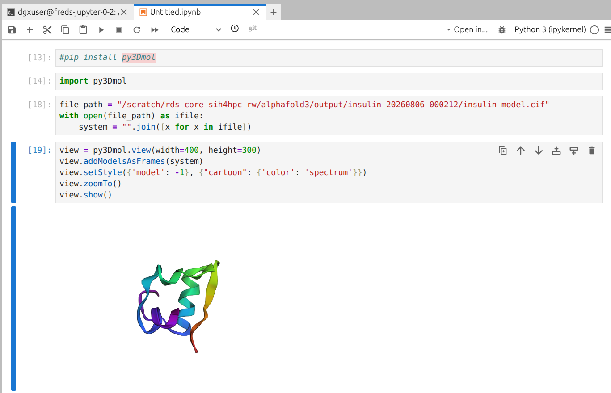
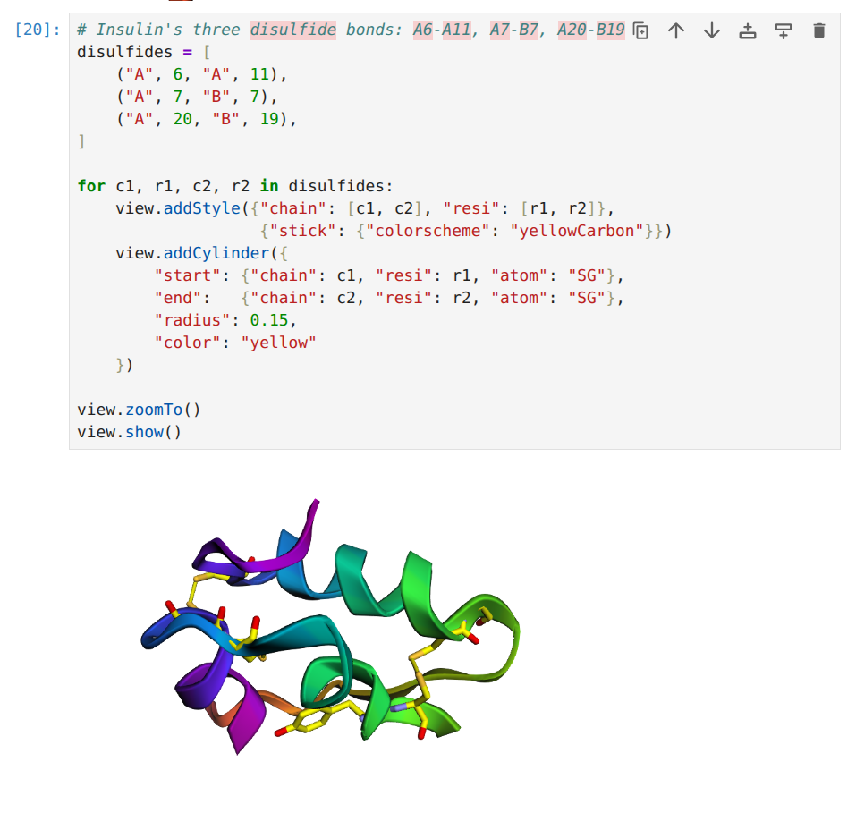

# How to run AlphaFold3 on the Apollo GPU Cluster



[AlphaFold3](https://github.com/google-deepmind/alphafold3) predicts the 3D structure of proteins, nucleic acids, and small molecules. You describe your molecules in a text file and AlphaFold3 returns predicted 3D structures with confidence scores.

In this guide, AlphaFold3 will be run as two separate jobs:

1. **Alignment job (CPU only):** searches large sequence databases to find proteins related to yours. No GPU required.
2. **Structure prediction job (GPU):** uses those alignment results to generate 3D structure predictions.

Splitting the work this way means the GPU is only reserved for the shorter prediction step, keeping your compute costs low.

:::{.callout-note}
**What SIH provides (no action needed):**

- A ready-to-use AlphaFold3 container image

**What you need to set up once before your first prediction:**

- AlphaFold3 model weights (`af3.bin`) from Google DeepMind - [Step 1](#step-1-download-model-weights)
- Sequence databases downloaded to your PVC (~394 GB) - [Step 2](#step-2-download-sequence-databases)
:::

:::{.callout-tip}
This guide is a work in progress. If you have feedback or run into issues, please [let us know](https://forms.cloud.microsoft/r/ezkDbt1YGp).
:::

## Prerequisites

### 1. Request model weights

AlphaFold3's model weights are provided by Google DeepMind under a non-commercial licence. Start your request now. Approval typically takes around 3 business days at the earliest. You will download the weights in Step 1 once approved.

Follow the request instructions on the [AlphaFold3 GitHub page](https://github.com/google-deepmind/alphafold3). You will fill in a short form and receive an email with a download link when access is approved.

### 2. Set up a JupyterLab workload

You will use a JupyterLab session throughout this guide to run setup commands, manage files, view outputs, and submit the folding jobs. Follow the [Creating a JupyterLab workload](jupyter_tutorial.html) guide's "create from scratch" workflow, applying these settings at [Step 2: Configure the workload](jupyter_tutorial.html#step-2-configure-the-workload-from-scratch):

- **Compute resources**: select CPU only as no GPU is needed for this session
- **Data & sources**: attach your project's PVC, the persistent storage described in [Data sources](runai_features.html#runai-data-sources), so JupyterLab can access your databases, weights, and input files. You will set these up on the PVC in [Step 1](#step-1-download-model-weights) and [Step 2](#step-2-download-sequence-databases) below

### 3. Install the runai CLI

The `runai` command-line interface (CLI) is used to submit and monitor jobs on the cluster. This guide runs the CLI from a JupyterLab terminal.

**Install the CLI**

Follow the [CLI setup guide](CLI.html) to download the installer. When prompted to select a platform, choose **Linux**.

**Log in from JupyterLab**

Open a terminal in JupyterLab (**File > New > Terminal**) and run:

```bash
runai login remote-browser
```

:::{.callout-important}
Use `runai login remote-browser`, not `runai login`. Because the terminal is running on a remote server, it cannot open a browser directly. The `remote-browser` option gives you a URL to open yourself instead.
:::

A URL will be printed in the terminal. Copy it, open it in your browser, and follow the prompts to authenticate. When you receive a token, paste it back into the terminal and press Enter.

Confirm the login was successful:

```bash
runai whoami
```

Your username and project should be displayed.

**Set your default project**

By default, `runai` commands need a project specified with `-p ${RUNAI_PROJECT}` on every command, or they will fail with `Error: project is missing`. Set a default now so you don't need to repeat this flag throughout the rest of this guide:

```bash
runai project set ${RUNAI_PROJECT}
```

## Step 1: Download model weights

The AlphaFold3 model weights (`af3.bin`) only need to be obtained once. If you have already downloaded a copy for a previous project, you can transfer that copy from the Research Data Store (RDS) instead of requesting it again. Choose the tab below that matches your situation.

::::{.panel-tabset}

## Download from DeepMind

Once you receive the approval email from Google DeepMind, open a terminal in JupyterLab (**File > New > Terminal**) and run the following commands.

:::{.callout-tip}
The `${RUNAI_PROJECT}` will automatically be populated with your Run:AI project name, so you can copy and paste the code directly from this guide.
:::

```bash
# Create a folder for the weights on your PVC
mkdir -p /scratch/${RUNAI_PROJECT}/alphafold3/params
cd /scratch/${RUNAI_PROJECT}/alphafold3/params

# Paste the download link from your approval email here
export DOWNLOAD_URL=https://paste-your-link-here

# Download the weights (this may take a few minutes)
wget -O af3.bin.zst "${DOWNLOAD_URL}"

# Decompress the file (requires ~2 GB of free space temporarily)
zstd -d af3.bin.zst

# Protect the file so only you can read it (required by the licence)
chmod 400 af3.bin

# Remove the compressed archive to recover space
rm af3.bin.zst
```

The decompressed `af3.bin` file is approximately 1.1 GB.

## Transfer from RDS

If a decompressed copy of `af3.bin` already exists on the Research Data Store (RDS) you can copy it directly to your PVC.

This uses the same `sftp` transfer method described in the [Data Transfer guide](data_transfer.html); see that guide for more detail on unikeys and RDS project IDs.

This uses the JupyterLab session and PVC you already set up in the [Prerequisites](#set-up-a-jupyterlab-workload) section, so no additional PVC setup is needed here. Open a terminal in JupyterLab (**File > New > Terminal**) and run:

```bash
# Create a folder for the weights on your PVC
mkdir -p /scratch/${RUNAI_PROJECT}/alphafold3/params
cd /scratch/${RUNAI_PROJECT}/alphafold3/params

# Set these to your details
export UNIKEY=abcd0123          # your University of Sydney unikey
export RDS_PROJECT=PRJ-1234     # your RDS project ID, found on DashR (https://dashr.sydney.edu.au/)
export RDS_PATH=path/to/af3.bin # the location of af3.bin within your RDS project

# Copy the weights file from RDS to your PVC
sftp "${UNIKEY}@research-data-ext.sydney.edu.au:/rds/${RDS_PROJECT}/${RDS_PATH}" .

# Protect the file so only you can read it (required by the licence)
chmod 400 af3.bin
```

You will be prompted for the password associated with your unikey to connect to RDS.

::::


## Step 2: Download sequence databases

:::{.callout-note}
Shared databases available to all cluster users are coming soon. Once live, this step will no longer be needed.
:::

The alignment job (Step 4) searches several large sequence databases. These must be downloaded once to your PVC. The full set is approximately 394 GB; **allow several hours for the download to complete**. The script is resumable if interrupted.

In your JupyterLab terminal, run:

```bash
# Create a folder for the databases on your PVC
mkdir -p /scratch/${RUNAI_PROJECT}/alphafold3/db
cd /scratch/${RUNAI_PROJECT}/alphafold3/db

# Download the AlphaFold3 setup scripts
git clone https://github.com/google-deepmind/alphafold3.git af3_repo

# Download all sequence databases to your PVC (takes several hours)
bash af3_repo/fetch_databases.sh /scratch/${RUNAI_PROJECT}/alphafold3/db
```

:::{.callout-important}
Do not close your JupyterLab session while the download is running. Closing the session will interrupt the download. You can however close the browser tab and reopen it later, but the JupyterLab workload itself must remain active.

You can work through Step 3 in a separate terminal tab while the download runs.
:::

Once the download finishes, verify the databases are in place:

```bash
ls -lh /scratch/${RUNAI_PROJECT}/alphafold3/db
```

Expected contents (~394 GB total):

```bash
total 394G
drwxr-x---  mmcif_files                                              (9.7M files - PDB structures)
-rw-r--r--  mgy_clusters_2022_05.fa                                  120G  MGnify protein clusters
-rw-r--r--  uniprot_all_2021_04.fa                                   102G  UniProt (TrEMBL + Swiss-Prot)
-rw-r--r--  nt_rna_2023_02_23_clust_seq_id_90_cov_80_rep_seq.fasta    76G  NT-RNA clusters
-rw-r--r--  uniref90_2022_05.fa                                       67G  UniRef90
-rw-r--r--  bfd-first_non_consensus_sequences.fasta                   17G  BFD
-rw-r--r--  rnacentral_active_seq_id_90_cov_80_linclust.fasta         13G  RNAcentral
-rw-r--r--  pdb_seqres_2022_09_28.fasta                              223M  PDB sequence clusters
-rw-r--r--  rfam_14_9_clust_seq_id_90_cov_80_rep_seq.fasta           218M  Rfam RNA families
```

Update the permissions of the database files and delete the git repository folder.

```bash
chmod -R 550 *
rm -rfv af3_repo/
```

## Step 3: Create your input file

AlphaFold3 reads a JSON file - a structured text file that describes the molecules you want to model. Create this file in JupyterLab before submitting your jobs.

This guide uses [insulin](https://www.rcsb.org/structure/3I40) as an example: a 51-residue protein made of two chains (a 21-residue A chain and a 30-residue B chain) linked by three disulfide bonds.

For your own proteins, replace the `sequence` value with your amino-acid sequence in single-letter code and remove `bondedAtomPairs` unless you are specifying bonds explicitly. The full input format is described in the [official documentation](https://github.com/google-deepmind/alphafold3/blob/main/docs/input.md).

1. In the JupyterLab file browser (left panel), navigate to `/alphafold3/`
2. Select **File > New > Text File** to create a new empty file
3. Right-click the new file and rename it to something informative. In this guide, we will fold insulin as an example and call the file `insulin.json`
4. Paste the following content into the file and save with **Ctrl+S**:

:::{.callout-tip}
The JupyterLab file browser shows your PVC's contents starting from `/`, so the `/alphafold3/` folder above is the same as `/scratch/${RUNAI_PROJECT}/alphafold3/` when working in a terminal. The alignment job in Step 4 reads the input file from this full terminal path, so this is where `insulin.json` needs to end up.
:::

```json
{
  "name": "insulin",
  "sequences": [
    {
      "protein": {
        "id": "A",
        "sequence": "GIVEQCCTSICSLYQLENYCN"
      }
    },
    {
      "protein": {
        "id": "B",
        "sequence": "FVNQHLCGSHLVEALYLVCGERGFFYTPKT"
      }
    }
  ],
  "bondedAtomPairs": [
    [["A", 6, "SG"], ["A", 11, "SG"]],
    [["A", 7, "SG"], ["B", 7, "SG"]],
    [["A", 20, "SG"], ["B", 19, "SG"]]
  ],
  "modelSeeds": [1],
  "dialect": "alphafold3",
  "version": 2
}
```

:::{.callout-note collapse="true"}
## JSON field reference

| Field | Description |
|---|---|
| `name` | Label for the prediction that is used in output file names |
| `sequences[].protein.id` | Chain identifier in the output structure (`"A"`, `"B"`, ...) |
| `sequences[].protein.sequence` | Amino-acid sequence in single-letter code. One continuous string, no spaces or line breaks |
| `bondedAtomPairs` | Explicit bonds to enforce. Each entry is `[chain_id, residue_number, atom_name]`. Use `"SG"` on cysteine (`C`) for disulfide bonds; residue numbers are 1-based. Omit this field if you have no explicit bonds. |
| `modelSeeds` | Each number produces one predicted structure - add more seeds for greater structural diversity |
| `dialect` / `version` | Always `"alphafold3"` and `2` |
:::

## Step 4: Run the alignment job [CPU-only]

The alignment job searches the sequence databases and produces pre-computed features used in Step 5. It runs on CPU only and does not need a GPU.

Create a new file (**File > New > Text File**). Rename it to something like `align.sh`.

Next, copy the following code, paste it into `align.sh`. Save and close the file.

Note that the `JOB_NAME` is set to the same name as the json file.

```bash
#!/bin/bash
# AlphaFold3 alignment job - searches sequence databases (CPU only, no GPU needed)
# Run this first, wait for it to complete, then run inference.sh

# ── Edit this line before running ─────────────────────────────────────
JOB_NAME=insulin   # label for this prediction; also the name of your input JSON file
# ──────────────────────────────────────────────────────────────────────

runai training submit "${JOB_NAME}-align" \
  -p "${RUNAI_PROJECT}" \
  --image sydneyinformaticshub/alphafold3:v3.0.2-20260604 \
  --image-pull-policy IfNotPresent \
  -c \
  --cpu-core-limit 8 \
  --cpu-memory-limit 64G \
  --large-shm \
  --existing-pvc "claimname=pvc-${RUNAI_PROJECT},path=/scratch/${RUNAI_PROJECT}" \
  -- python run_alphafold.py \
      --json_path="/scratch/${RUNAI_PROJECT}/alphafold3/${JOB_NAME}.json" \
      --model_dir="/scratch/${RUNAI_PROJECT}/alphafold3/params" \
      --db_dir="/scratch/${RUNAI_PROJECT}/alphafold3/db" \
      --output_dir="/scratch/${RUNAI_PROJECT}/alphafold3/output" \
      --run_inference=false
```

:::{.callout-tip}
If the job fails to submit with an error mentioning your PVC claim (for example `PersistentVolumeClaim "pvc-${RUNAI_PROJECT}" not found`), your project's PVC uses a different naming convention. Run `runai pvc list -p ${RUNAI_PROJECT}` to find the actual claim name, then replace `pvc-${RUNAI_PROJECT}` in the `--existing-pvc` flag above with that name.
:::

Before submitting, confirm your input file is where the job expects it to be:

```bash
ls -lh /scratch/${RUNAI_PROJECT}/alphafold3/insulin.json
```

If this reports "No such file or directory", the file is not saved in the right place - check that you saved `insulin.json` in `/alphafold3/` in the JupyterLab file browser (Step 3), and that `JOB_NAME` above matches the file name exactly.

Submit the job in the Terminal by running:

```bash
bash align.sh
```

Once submitted, you should see the following message:

```md
Creating training insulin-align...
To track the workload's status, run 'runai training standard describe insulin-align'
```

To check whether the job is running and when it finishes, either check the **Workloads** page in the Run:AI web interface, or run:

```bash
# Show a summary of all your jobs and their current status
runai training list

# Stream live logs (press Ctrl+C to stop)
runai training logs "insulin-align" -f
```

Wait until the job status shows **Completed** before continuing to Step 5. This typically takes around 45 minutes for insulin.

To verify the alignment completed successfully, open the JupyterLab file browser and confirm the folder `/alphafold3/output/insulin/` (`/scratch/${RUNAI_PROJECT}/alphafold3/output/insulin/` in a terminal) exists and contains one file: `insulin_data.json`. This is the pre-computed features file that Step 5 reads. You can also check from the terminal:

```bash
ls -lh /scratch/${RUNAI_PROJECT}/alphafold3/output/${JOB_NAME}/
```

In case you need to resubmit a job, first delete the existing run with `runai training delete insulin-align`, then rerun `bash align.sh`.

## Step 5: Run the structure prediction job [GPU]

Once the alignment job has completed, submit the GPU step. This reads the pre-computed features written by Step 4.

Similarly, create a new file called `inference.sh`. Copy and paste the following:

:::{.callout-tip}
Notice that `--json_path` below points into the alignment job's `output` folder, not to `insulin.json` from Step 3. The alignment job (Step 4) writes a new file, `${JOB_NAME}_data.json`, containing the pre-computed features - that is the file the inference job needs to read.
:::

```bash
#!/bin/bash
# AlphaFold3 inference job - generates 3D structure predictions (requires GPU)
# Run this only after align.sh has completed

# ── Edit this line before running ──────────────────────────────────────
JOB_NAME=insulin    # must match the JOB_NAME used in align.sh
# ───────────────────────────────────────────────────────────────────────

runai training submit "${JOB_NAME}-inference" \
  -p "${RUNAI_PROJECT}" \
  --image sydneyinformaticshub/alphafold3:v3.0.2-20260604 \
  --image-pull-policy IfNotPresent \
  -c \
  --gpu-portion-request 0.1 \
  --cpu-core-request 8 \
  --cpu-memory-request 64Gi \
  --existing-pvc "claimname=pvc-${RUNAI_PROJECT},path=/scratch/${RUNAI_PROJECT}" \
  -- python run_alphafold.py \
      --json_path="/scratch/${RUNAI_PROJECT}/alphafold3/output/${JOB_NAME}/${JOB_NAME}_data.json" \
      --model_dir="/scratch/${RUNAI_PROJECT}/alphafold3/params" \
      --output_dir="/scratch/${RUNAI_PROJECT}/alphafold3/output" \
      --run_data_pipeline=false \
      --num_diffusion_samples=5
```

Before submitting, confirm the alignment job's output file is in place:

```bash
ls -lh /scratch/${RUNAI_PROJECT}/alphafold3/output/${JOB_NAME}/insulin_data.json
```

If this reports "No such file or directory", wait for the alignment job (Step 4) to reach **Completed** and check again - the inference job cannot run without this file.

Submit the job:

```bash
bash inference.sh
```

Commands to check on the job:

```bash
runai training list
runai training logs insulin-inference -f
```

Once completed, the output of `runai training logs insulin-inference` should display something similar as the following:

```md
Found local devices: [CudaDevice(id=0)], using device 0: cuda:0
Building model from scratch...
Checking that model parameters can be loaded...

Running fold job insulin...
Output will be written in /scratch/rds-core-sih4hpc-rw/alphafold3/output/insulin_20260717_074703 since /scratch/rds-core-sih4hpc-rw/alphafold3/output/insulin is non-empty.
Skipping data pipeline...
Writing model input JSON to /scratch/rds-core-sih4hpc-rw/alphafold3/output/insulin_20260717_074703/insulin_data.json
Predicting 3D structure for insulin with 1 seed(s)...
Featurising data with 1 seed(s)...
Featurising data with seed 1.
Featurising data with seed 1 took 0.20 seconds.
Featurising data with 1 seed(s) took 8.88 seconds.
Running model inference and extracting output structure samples with 1 seed(s)...
Running model inference with seed 1...
Running model inference with seed 1 took 103.10 seconds.
Extracting inference results with seed 1...
Extracting 5 inference samples with seed 1 took 0.05 seconds.
Running model inference and extracting output structures with 1 seed(s) took 103.14 seconds.
Writing outputs with 1 seed(s)...
Fold job insulin done, output written to /scratch/rds-core-sih4hpc-rw/alphafold3/output/insulin_20260717_074703
```

:::{.callout-note}
For reference, insulin (51 residues, two chains) took around 45 minutes for alignment and under a minute for structure prediction. A shorter peptide, oxytocin (9 residues), took around 7 minutes for alignment and around 1 minute for structure prediction. Alignment time scales with sequence length; structure prediction stays fast regardless of protein size.
:::

## Visualise your results

Once the inference job shows **Completed**, your output files are in:

```
/scratch/${RUNAI_PROJECT}/alphafold3/output/insulin/
```



This folder contains:

| File / folder | Description |
|---|---|
| `insulin_model.cif` | The top-ranked predicted structure |
| `seed-<N>_sample-<N>/` | One folder per predicted sample, each containing that sample's structure and confidence files |
| `insulin_summary_confidences.json` | Overall confidence scores (e.g. pTM, ipTM) for the top-ranked structure |
| `insulin_confidences.json` | Detailed, per-residue confidence scores for the top-ranked structure |
| `insulin_ranking_scores.csv` | Confidence scores for every sample, used to rank them |
| `insulin_data.json` | The input file AlphaFold3 used to run the prediction |
| `TERMS_OF_USE.md` | AlphaFold3's output terms of use |

Structure files (`.cif`) can be viewed in tools such as [Mol\*](https://molstar.org/viewer/) or [PyMOL](https://pymol.org/).

Here we will use an interactive Jupyter notebook and the `py3Dmol` package to visualise our results.

1. File -> New -> Notebook
2. If prompted, select the Python3 (ipykernel)
3. Install `py3Dmol` with `pip install py3Dmol`
4. Run the following in a cell, updating `file_path` to point at your `insulin_model.cif`:

```python
import py3Dmol

file_path = "/scratch/${RUNAI_PROJECT}/alphafold3/output/insulin/insulin_model.cif"
with open(file_path) as ifile:
    system = "".join([x for x in ifile])

view = py3Dmol.view(width=400, height=300)
view.addModelsAsFrames(system)
view.setStyle({'model': -1}, {"cartoon": {'color': 'spectrum'}})
view.zoomTo()
view.show()
```



5. Optionally, run the following in a new cell to highlight insulin's three disulfide bonds (the same bonds specified in `bondedAtomPairs` in Step 3) as yellow sticks on the structure:

```python
# Insulin's three disulfide bonds: A6-A11, A7-B7, A20-B19
disulfides = [
    ("A", 6, "A", 11),
    ("A", 7, "B", 7),
    ("A", 20, "B", 19),
]

for c1, r1, c2, r2 in disulfides:
    view.addStyle({"chain": [c1, c2], "resi": [r1, r2]},
                   {"stick": {"colorscheme": "yellowCarbon"}})
    view.addCylinder({
        "start": {"chain": c1, "resi": r1, "atom": "SG"},
        "end":   {"chain": c2, "resi": r2, "atom": "SG"},
        "radius": 0.15,
        "color": "yellow"
    })

view.zoomTo()
view.show()
```



:::{.callout-tip}
Found this guide helpful, or noticed something missing? [Share your feedback](https://forms.cloud.microsoft/r/ezkDbt1YGp).
:::

## Command reference

:::{.callout-note collapse="true"}
## runai training submit flags

| Flag | Value in this guide | Purpose |
|------|---------------------|---------|
| *(job name)* | `${JOB_NAME}-align` or `${JOB_NAME}-inference` | Unique name for this job within your project |
| `-p` | `${RUNAI_PROJECT}` | Your Run:AI project |
| `--image` | `sydneyinformaticshub/alphafold3:v3.0.2-20260604` | The AlphaFold3 container image |
| `--image-pull-policy` | `IfNotPresent` | Reuses a locally cached image instead of re-downloading on every run |
| `-c` | *(flag)* | Allows you to specify the command to run inside the container |
| `--cpu-core-limit` / `--cpu-memory-limit` | `8` / `64G` (alignment only) | Maximum CPU cores and RAM the job may use |
| `--cpu-core-request` / `--cpu-memory-request` | `8` / `64Gi` (inference only) | CPU cores and RAM reserved for the job |
| `--large-shm` | *(flag, alignment only)* | Increases shared memory size, required by the database search tools |
| `--gpu-portion-request` | `0.5` (inference only) | Fraction of one GPU to use; 0.5 = half an H200 (~70 GB VRAM) |
| `--existing-pvc` | `claimname=pvc-${RUNAI_PROJECT},...` | Mounts your persistent storage so the job can read your databases, weights, and input file |

## AlphaFold3 flags

| Flag | Purpose |
|------|---------|
| `--json_path` | Path to the JSON file describing the molecules you want to predict |
| `--model_dir` | Folder containing the model weights file (`af3.bin`) |
| `--db_dir` | Folder containing the sequence databases (alignment job only) |
| `--output_dir` | Folder where results are written; created automatically if it does not exist |
| `--run_inference=false` | Alignment job only: skip the GPU prediction step and stop after the database search |
| `--run_data_pipeline=false` | Inference job only: skip the database search and use the pre-computed results from the alignment job |
| `--num_diffusion_samples` | Number of predicted structures to generate per model seed; 5 is the default |
:::

## Troubleshooting

| Symptom | Likely cause | Fix |
|---------|-------------|-----|
| Job stays in `Pending` | No suitable node is available (e.g. no free GPU for the inference job) | Wait for a free slot; run `runai training describe ${JOB_NAME}-inference -p ${RUNAI_PROJECT}` or check the Run:AI web interface to see the queue |
| Job stuck in `ContainerCreating` for 5-10 min | The container image is being downloaded to that node for the first time (~15 GB) | No action needed; run `runai training describe ${JOB_NAME}-align -p ${RUNAI_PROJECT}` and look for a `Pulled` message in the Events section |
| `FileNotFoundError: af3.bin` | The weights file is missing or in the wrong location | Confirm `af3.bin` is directly inside `alphafold3/params/`, not inside a subfolder |
| `FileNotFoundError` for a database file | A database file is missing or has an unexpected name | Verify all files from `fetch_databases.sh` are in `alphafold3/db/` with their original names |
| XLA compilation takes 20+ minutes on first run | The GPU kernel is compiled on first use for your protein's length | Expected on the first run only; subsequent runs reuse the compiled result stored in `output_dir` |
| `Error: project is missing. value is empty.` | No default project is set for `runai` commands | Run `runai project set ${RUNAI_PROJECT}`, or add `-p ${RUNAI_PROJECT}` to the command |
| `Error: unknown flag: --some-flag` | The flag name doesn't match the `runai` CLI version installed | Run `runai training submit --help` to check current flag names |
| `FileNotFoundError` for the inference job's `--json_path` | The alignment job (Step 4) hasn't finished, or `JOB_NAME` doesn't match between `align.sh` and `inference.sh` | Confirm `${JOB_NAME}_data.json` exists in `alphafold3/output/${JOB_NAME}/` before running `inference.sh` |

## Coming soon

- **Shared databases** - sequence databases will be available on a shared cluster path for all users, removing the need for [Step 2](#step-2-download-sequence-databases)
- **Benchmarking** - estimates for how many GPU hours it takes based on protein and analysis

