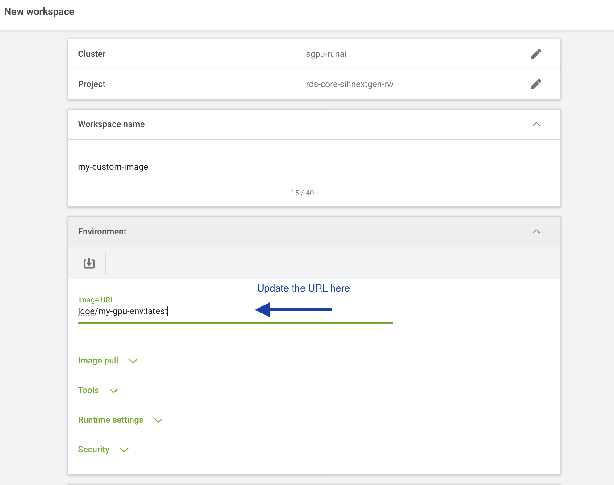

# Tutorial: Building and Using a Custom Docker Image

This tutorial walks you through building a custom Docker image based on the SIH DGX base image, pushing it to Docker Hub, and using it to launch a Jupyter Lab workload on the SIH GPU cluster. This is useful when you need a personalised compute environment — for example, to pre-install packages, set up specific library versions, or include your own tools — while still being able to use Jupyter Lab as your interactive front end.

If you are new to workloads and Jupyter Lab on the cluster, read [Tutorial: Running a Jupyter Lab Workload](jupyter_tutorial.md) first.

::: {.callout-important}
The exact steps in this tutorial may not cover every use case. Depending on the application you are building, you may need to adjust the Dockerfile, the environment configuration, or other workload settings. 

**The GPU cluster base image (`sydneyinformaticshub/dgx-interactive-jupyterlab`) will be updated from time to time.** If you are unsure how to proceed or run into issues, please reach out to the SIH team for assistance.
:::

## Prerequisites

Before starting, make sure you have:

* [Docker](https://docs.docker.com/get-docker/) installed on your local machine
* A free [Docker Hub](https://hub.docker.com) account
* Basic familiarity with the terminal

## Step 1: Write a Dockerfile

Create a new directory for your project and create a file named `Dockerfile` inside it. Start `FROM` the SIH DGX base image [`sydneyinformaticshub/dgx-interactive-jupyterlab`](https://hub.docker.com/r/sydneyinformaticshub/dgx-interactive-jupyterlab), which already has Jupyter Lab and common data science packages (TensorFlow, PyTorch, pandas, ollama) installed.

```dockerfile
FROM sydneyinformaticshub/dgx-interactive-jupyterlab:latest

ENV PACKAGES="package1 \
              package2"

RUN apt-get update && apt-get install -y $PACKAGES
# Create a separate requirements.txt file in the same folder with a list of python packages to install
RUN pip install -r requirements.txt
```

Replace the `RUN` line with whatever packages or configuration your environment requires. You can add multiple `RUN` instructions, copy in files, or set environment variables — refer to the [Docker documentation](https://docs.docker.com/reference/dockerfile/) for the full Dockerfile syntax.

::: {.callout-tip}
During the image build process you have full `sudo` (root) access inside the container, so you can install system-level packages with `apt-get` or make other privileged changes. This flexibility is not available when running the container on the SIH GPU cluster, where `sudo` is disabled for security reasons. Any system-level setup should therefore be done here in the Dockerfile, not at runtime.
:::

## Step 2: Build the image

From the directory containing your `Dockerfile`, run:

```bash
docker build -t <your-dockerhub-username>/<image-name>:<tag> .
```

For example:

```bash
docker build -t jdoe/my-gpu-env:latest .
```

The build may take several minutes depending on the packages you are installing. Once complete, verify the image was created:

```bash
docker images
```

## Step 3: Push the image to Docker Hub

Log in to Docker Hub from the terminal:

```bash
docker login
```

Enter your Docker Hub username and password when prompted. Then push the image:

```bash
docker push <your-dockerhub-username>/<image-name>:<tag>
```

For example:

```bash
docker push jdoe/my-gpu-env:latest
```

Once the push completes, the image will be publicly accessible at `<your-dockerhub-username>/<image-name>:<tag>`.

::: {.callout-note}
Docker Hub free accounts allow unlimited public repositories. Make sure your repository visibility is set to **Public** so the cluster can pull it without authentication.
:::

## Step 4: Launch a Jupyter Lab workload with your custom image

You can now use your custom image on the SIH GPU cluster by following the [Tutorial: Running a Jupyter Lab Workload](jupyter_tutorial.md), with one change in Step 2: when selecting the **Environment**, choose the `jupyter-notebook` environment as usual, then replace the pre-filled image URL with the full path to your custom image (e.g. `jdoe/my-gpu-env:latest`).



All other steps remain the same. Because your image is built on top of `sydneyinformaticshub/dgx-interactive-jupyterlab`, the Jupyter Lab server will start automatically, and you will be able to connect via **Jupyter** under "CONNECT" once the workload is running — with your custom packages and configuration available inside the session.

## Future maintenance: updating your image

If you need to add or change packages in the future, update your `Dockerfile` and repeat Steps 2 and 3 to rebuild and push the updated image. We recommend incrementing the tag each time (e.g. `v1`, `v2`) so you can track versions and roll back if needed. The next workload you launch using that image name will automatically pull the latest version.


