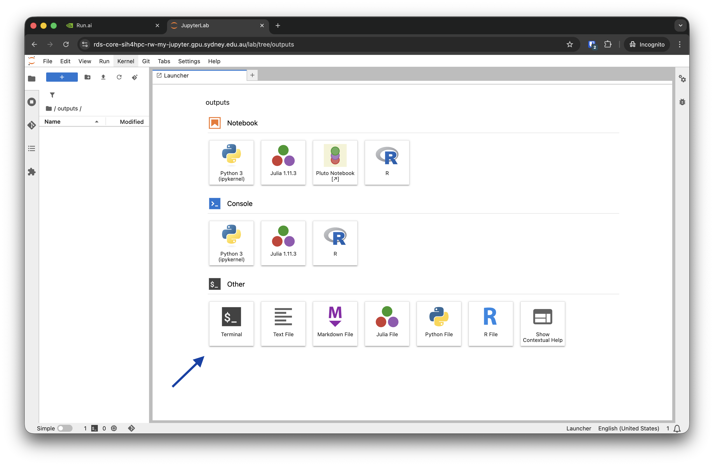

# How to transfer data to and from the Persistent volume claim

In this section we will describe methods of transferring data between the Research Data Store (RDS) and Gadi. For now, while we await the implementation of [Globus](https://sydneyuni.atlassian.net/wiki/spaces/RC/pages/3492052996/Globus+Data+Transfer) for fast and efficient transfer to and from your Persistent Volume Claim (PVC), we will describe an interactive method for transferring data using a JupyterLab environment in the Run:ai web interface. In the future we will include instructions for copying data using the Run:AI CLI at the command line.

Here we assume you already have set up a [project](runai_features.md#runai-projects) and have some Persistent Volume Claim (PVC) [storage](runai_features.md#runai-data-sources) available.

## Interactive data transfer to/from RDS from a web-browser

You can easily transfer data between your Persistent Volume Claim (PVC) and RDS from inside the Run:ai web browser interface. We have set up an [environment](runai_features.md#runai-environments) called `data-transfer` for you to do this.

To run the `data-transfer` environment from a template:

1. Log into the Run:ai dashboard at [gpu.sydney.edu.au](https://gpu.sydney.edu.au) and use Okta to login with your credentials via the "CONTINUE WITH SSO" sign in option.

2. Click the 'Workload manager' icon in the left panel and then select 'Workloads' in the menu. Next select the green '+ NEW WORKLOAD' icon in the top left of the workloads screen and select 'Workspace'.


3. Select your project from the projects available and select the `data-transfer-workspace` template and give your workspace a name before selecting 'Advanced Setup' on the bottom right.

4. If you have selected the `data-transfer-workspace` template, you should now have pre-populated the required `Environment` and `Compute resources` fields on the following page. You can double check this now.

5. Expand the `Data & storage` box and select the small icon in the top left. You will see a list of PVCs associated with your project, select this from the list.


6. When you are happy with everything, click CREATE WORKSPACE and your data transfer environment will be created. When this is provisioned click the CONNECT icon above the list of workloads. 


7. You will again be prompted for your Run:ai login and your newly created JupyterLab session will appear in a new tab in your browser. Select the 'Terminal' app there.



8. In the open terminal app you can now use the sftp command to copy data to/from your project space in RDS.

To copy data from RDS to the GPU cluster, you can type the following into the open terminal:

::: {.callout-note}
Be sure to replace everything in brackets `<` `>` with values specific to the data you are trying to copy as follows:

`<your_unikey>`: Your University of Sydney unikey, usually in the form abcd0123.

`<rds_project>`: The name of the project you have on [DashR](https://dashr.sydney.edu.au/) with data stored in RDS.

`<path_to_project_data>`: The location of your storage directory under your project on RDS. (e.g. `my_project_data/my_project_data_for_dgx/`)

`<pvc_mount_point>`: The location your PVC has been mounted (this is established when your PVC is provisioned). (e.g. `/scratch`)

`<path_to_pvc_data>`: The path of the data you have stored on the PVC. (e.g. `my_dgx_data/workflow_output/`)
:::

```bash
sftp -r <your_unikey>@research-data-ext.sydney.edu.au:/rds/PRJ-<Project Short ID>/<Path to File or Folder> <pvc_mount_point>/<path_to_pvc_data>
```

After you execute this command, you will be prompted for the password associated with your unikey to establish a connection to RDS. 

To copy data from the GPU cluster to RDS, reverse the order of source and destination in the above command:

```bash
sftp <your_unikey>@research-data-ext.sydney.edu.au:/rds/PRJ-<Project Short ID>/<Path to File or Folder> <<< $"put -r <pvc_mount_point>/<path_to_pvc_data>"
```

During file transfer, for larger files, you can close the browser and leave things running in the background. You can then reconnect to check its status by logging back into the web UI at [gpu.sydney.edu.au](https://gpu.sydney.edu.au).


