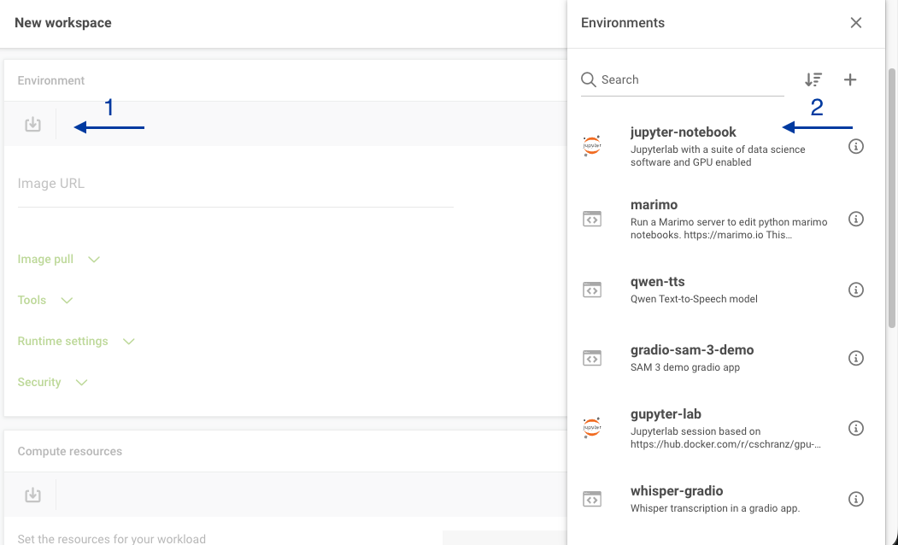
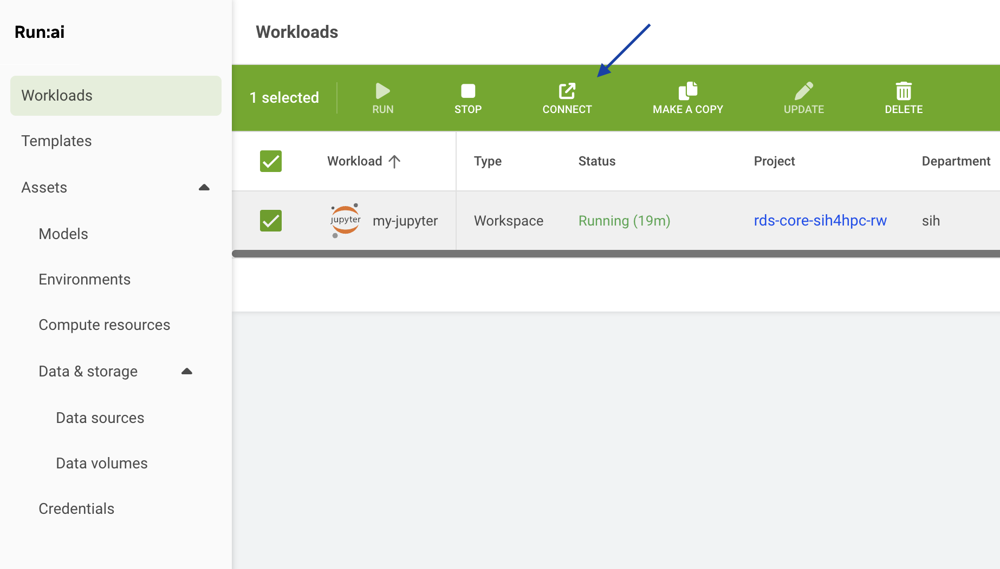

# Tutorial: Running a Jupyter Lab Workload
A workload is the actual job or task you want to run on the platform. This could be training an AI model, and running an inference model and exposing its endpoint, doing data preprocessing, or conducting a scientific simulation.

Generally, the minimum requirements you need before creating the workload include:

* Being granted permission to an [active project](runai_features.md#runai-projects)
* An [environment](runai_features.md#runai-environments) to run such job
* Have a [data source](runai_features.md#runai-data-sources), e.g. a PVC, to store your input and output data
* Understand the [compute resources](runai_features.md#runai-compute-resources) requirements you need to run the job

In this tutorial, we will create a basic Jupyter Lab workload that allows you to run Jupyter notebooks interactively on the Apollo GPU cluster.

## Step 1: Create a workload
Navigate to the "Workload manager" section, select "Workloads", and click on the "NEW WORKLOAD" button. Select "Workspace" from the dropdown menu.

## Step 2: Configure the workload from scratch
Define the necessary information for your workload:

* The "Cluster" section will be set automatically, you do not need to change this
* Under "Projects" select the project it will be linked to
* Under "Templates" select "Start from scratch" (*i.e.* do not use any existing template)
* Provide a descriptive name for the workload

    

* Under "Environment", select the `jupyter-notebook` environment to create the workload. This environment pulls a [pre-built image](https://hub.docker.com/r/sydneyinformaticshub/dgx-interactive-jupyterlab) (`sydneyinformatics/dgx-interactive-jupyterlab`) that has Jupyter Lab and commonly used data science/AI packages installed, including Tensorflow, pytorch, pandas, and ollama. The `jupyter-notebook` environment is also configured to intialise the Jupyter Lab server directly from the PVC.
    

* Under "Compute resources", select the amount of compute resources to run the workload. In this tutorial, we will select the `small-fraction` option that requires 1 H200 GPU with 10% of its memory (~14GB). Depending on the actual workload you're running, this option can be adjusted accordingly.

    

* Click "Data & sources" to expand this section and configure the data source to be mounted to the container. Here we select the default PVC created for the project. The mount path inside the container is set to `/scratch/<runai-project-name>`.

    

* Finally, click on "CREATE WORSPACE" to submit the workload to the cluster. The workspace can take a few minutes to initialise.

## Step 3: Connect to Jupyter Lab

When the status changes to "Running", you can access the Jupyter Lab interface by selecting "Jupyter" under "CONNECT".

## (Optional) Step 4: Inspect system logs
You can also further view details of the workload including

* Event history: This information is especially useful for debugging issues when a workload fails to start or is pending for a long time.
* Metrics: This contains real time GPU and CPU usage, which helps optimise resource utilisation.
* Logs: This provides an easy access to the container's outputs and any error messages.
* Details: This tab includes all container runtime settings.

