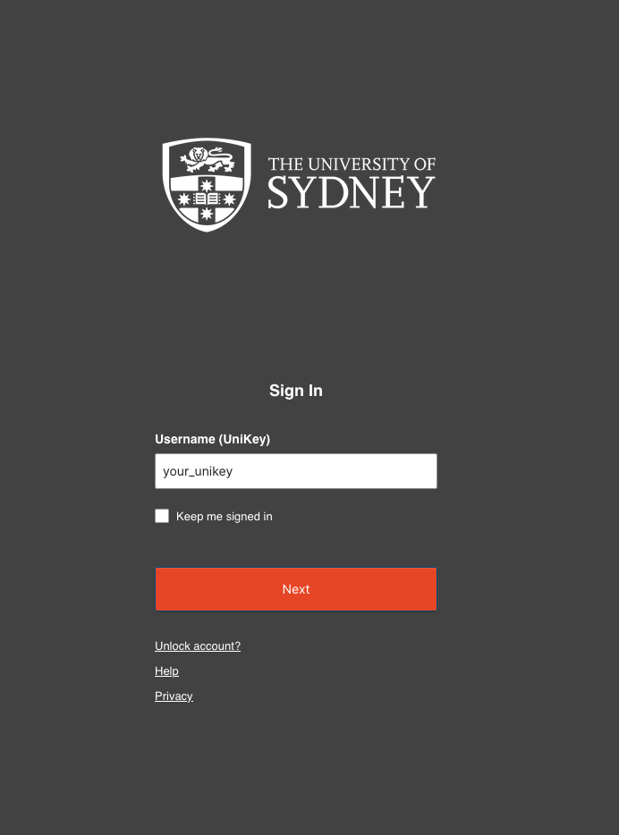
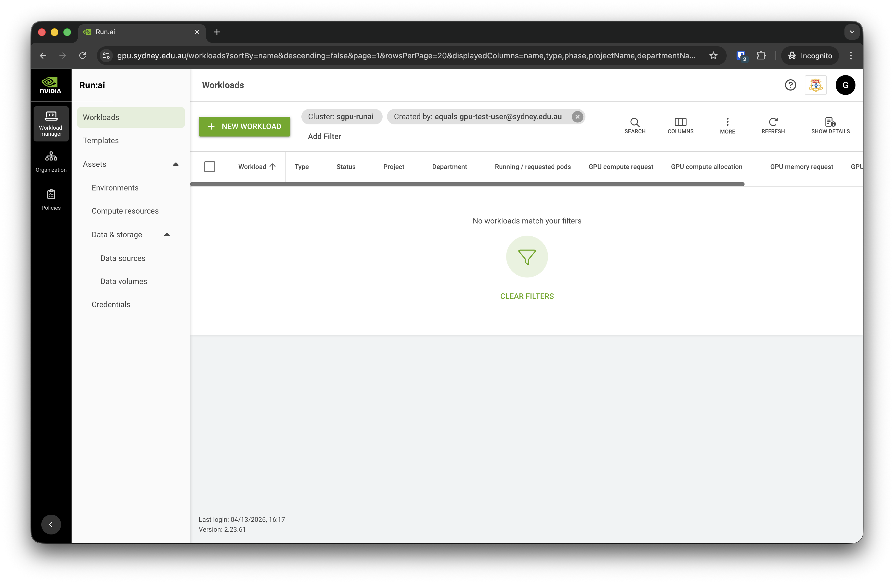

# Login
:::{.callout-important}
Before trying to log into the Apollo cluster, please make sure you are part of a DashR project that has been [granted cluster access](https://sydneyuni.atlassian.net/wiki/spaces/RC/pages/4794843139/Apollo+-+set+up+a+project#1.-Enable-Apollo-for-the-DashR-project.).

Please note that it may take some time for the DashR provisioner to grant SSO access and set up the project in Run:AI before you can view the landing page.
:::

1. If you are not on the Sydney university network (e.g. working from home), you will need to [connect to the VPN](https://sydneyuni.service-now.com/sm?id=kb_article_view&sysparm_article=KB0011460) to see the login page.
2. Go to: <https://gpu.sydney.edu.au/>.
3. Enter your UniKey and password.

4. Once the login is successful, you'll be presented with the landing (“Workloads”) page.

