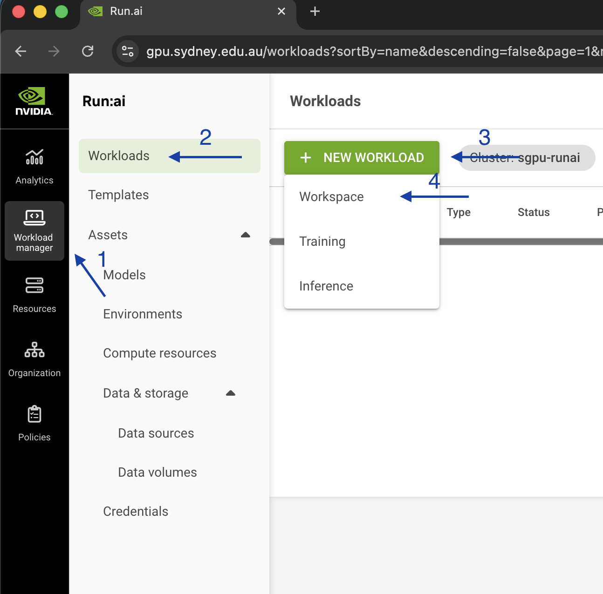
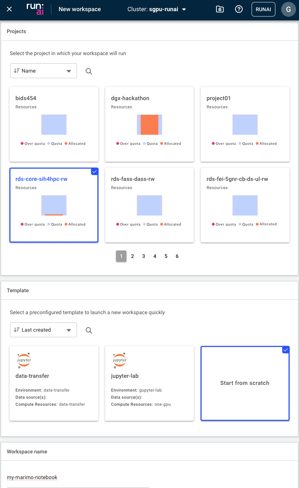
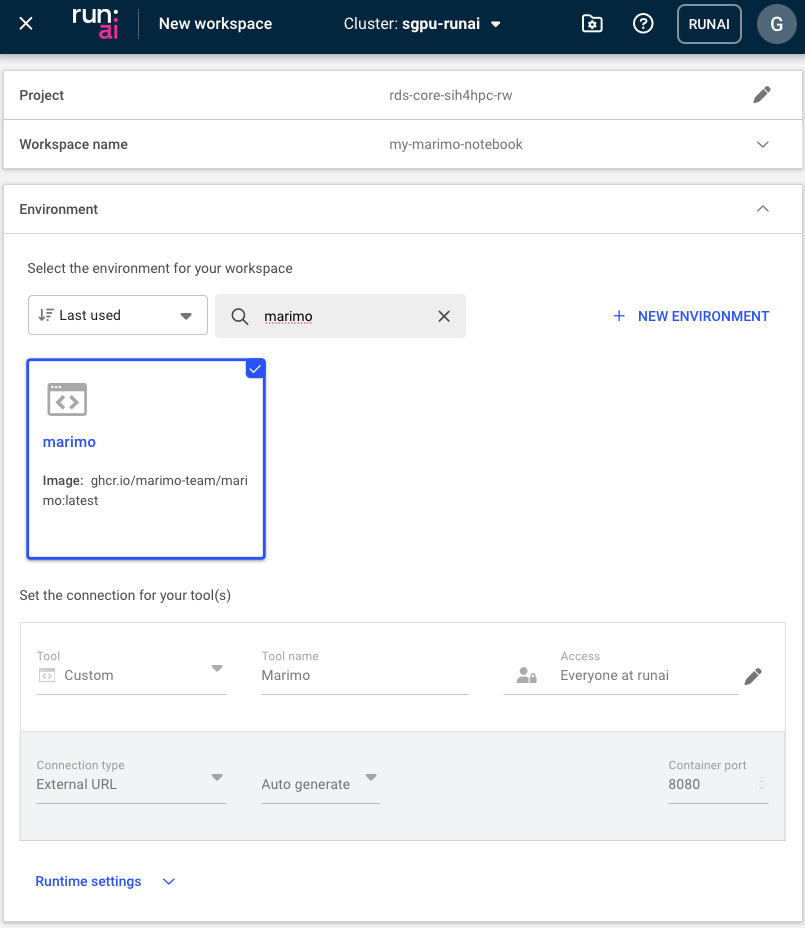
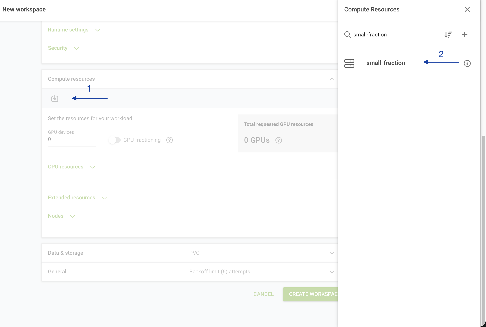
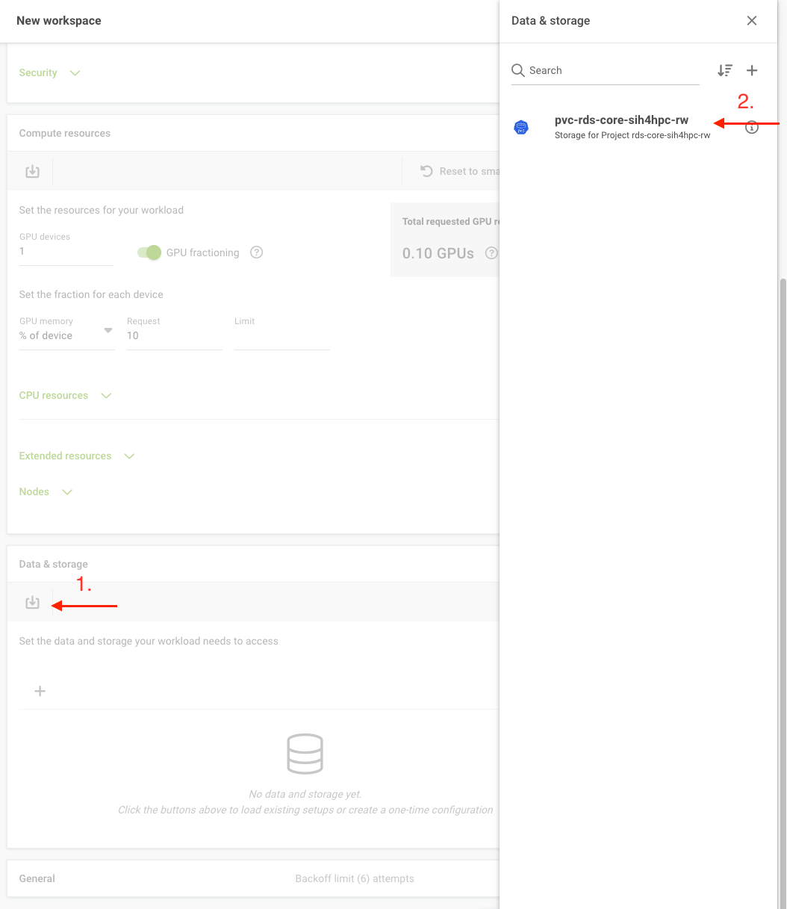
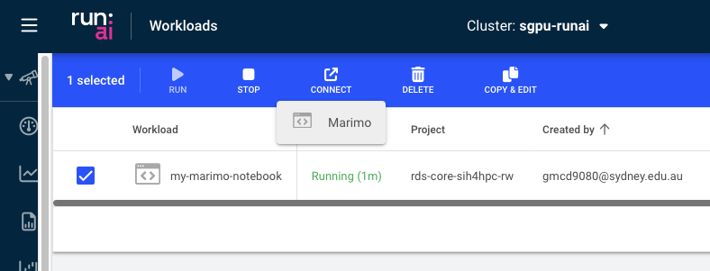
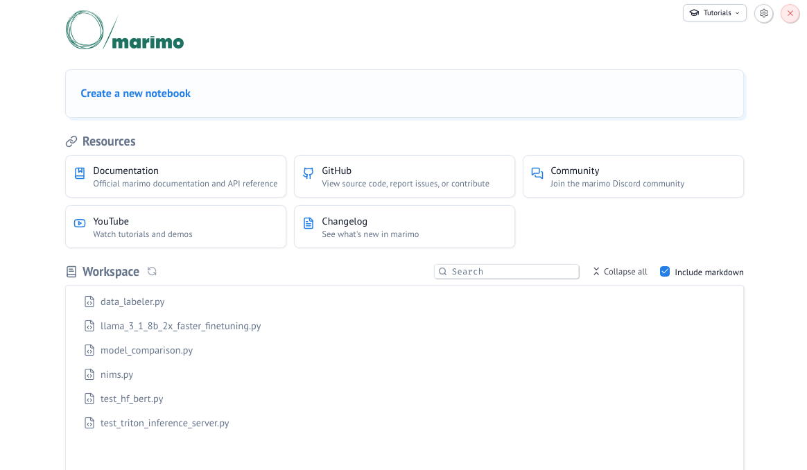
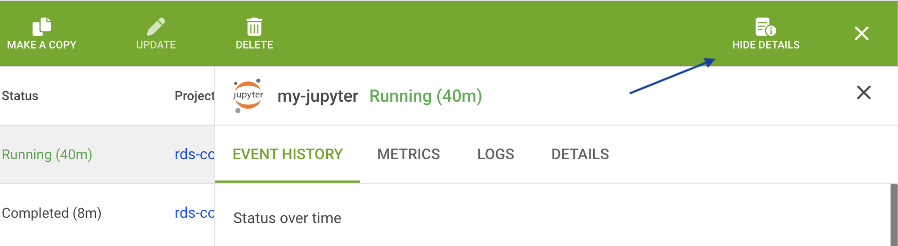

# Tutorial: Running a [Marimo Notebook](https://marimo.io) Workspace

A workload is the actual job or task you want to run on the platform. This could be training an AI model, and running an inference model and exposing its endpoint, doing data preprocessing, or conducting a scientific simulation.

Generally, the minimum requirements you need before creating the workload include:

* Being granted permission to an [active project](runai_features.md#runai-projects)
* An [environment](runai_features.md#runai-environments) to run such job
* Have a [data source](runai_features.md#runai-data-sources), e.g. a PVC, to store your input and output data
* Understand the [compute resources](runai_features.md#runai-compute-resources) requirements you need to run the job

In this tutorial, we will create a simple Marimo workload that allows you to run python Marimo notebooks interactively on the Apollo GPU cluster.

[Marimo notebook example gallery](https://marimo.io/gallery)

## Step 1: Create a workload

Navigate to the Workloads section of the platform and click on the "NEW WORKLOAD" button. Select "Workspace" from the dropdown menu.

## Step 2: Configure the workload from scratch

Define the necessary information for your workload:

-   The “Cluster” section will be set automatically, you do not need to change this
-   Under "Projects" select the project it will be linked to
-   Under "Templates" select "Start from scratch" (*i.e.* do not use any existing template)
-   Provide a descriptive name for the workload

-   Select an environment to create the container. The SIH team has set up the [marimo:latest container image](https://github.com/marimo-team/marimo/pkgs/container/marimo) (`ghcr.io/marimo-team/marimo:latest`) to run in [uv](https://docs.astral.sh/uv/) so that packages can be install automatically.

-   Select the amount of compute resources to run the workload. In this tutorial, we will select the `small-fraction` option that requires 1 H200 GPU with 10% of its memory (\~14GB).

* Click "Data & sources" to expand this section and configure the data source to be mounted to the container. Here we select the default PVC created for the project. The mount path inside the container is set to `/scratch/<runai-project-name>`.

* Finally, click on "CREATE WORSPACE" to submit the workload to the cluster. The workspace can take a few minutes to initialise.

## Step 3: Connect to Marimo

When the status changes to "Running", you can access the Marimo interface by selecting "Marimo" under "CONNECT".

## Step 4. Create New Notebook in Marimo

You're ready to go!

## (Optional) Step 5: Inspect system logs

You can review the system logs to access details about event history, workload metrics, and real-time container output. This information is especially useful for debugging issues when a workload fails to start.

