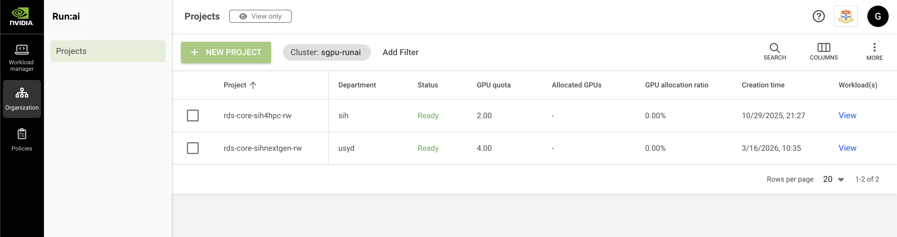
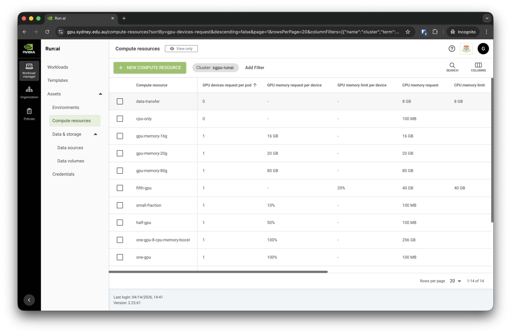
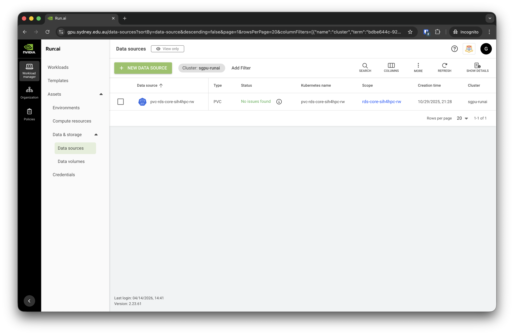

# Key Run:ai Features

## Projects {#runai-projects}
In Run:ai, users are organised into [projects](https://run-ai-docs.nvidia.com/self-hosted/2.23/platform-management/aiinitiatives/organization/projects). This allows cluster users to work collaboratively and access shared resources including GPU devices and scratch disk space.

Once a DashR project has been provisioned access to the SIH GPU cluster, all members of the project will automatically be added to a Run:ai project resembling the DashR project shortcode (e.g. "rds-core-sih4hpc-rw"). Users may be added to multiple Run:ai projects if the corresponding DashR projects have been granted access.

:::{.callout-note}
Creating new projects and adjusting project settings in Run:ai are restricted to **system administrators only**. Chief Investigators of the DashR project can administrate user access to the GPU cluster by adding or removing them from the [DashR project](https://dashr.sydney.edu.au/projects).
:::

## Workloads

A [**workload**](https://run-ai-docs.nvidia.com/self-hosted/2.23/workloads-in-nvidia-run-ai/workloads) in Run:ai represents a unit of compute work submitted to the cluster, such as a training job, interactive session, or inference service. Workloads are scheduled and managed by the Run:ai scheduler, which optimises GPU allocation across projects and users based on defined quotas and priorities. From the Workloads page, users can submit new workloads, monitor their status, and manage existing ones.

Examples of creating different workloads are included in the [Tutorials section](jupyter_tutorial.md).

## Environments {#runai-environments}
In Run:AI, an [**environment**](https://run-ai-docs.nvidia.com/self-hosted/2.23/workloads-in-nvidia-run-ai/assets/environments) consists of a set of configurations that define the software setup needed to run your AI workloads. An environment typically includes:

- Base Docker image (e.g., `pytorch/pytorch`, `tensorflow/tensorflow:2.20.0-jupyter`)
- Tools (such as Jupyter, RStudio, etc.)
- Custom runtime settings to run scripts or setup commands (e.g., installing extra packages, configuring the base URL, etc.)

:::{.callout-important}
The SIH team is actively configuring and testing new environments on the cluster. Please follow related tutorials for the applications you intend to run and make sure correct environments are selected when creating workloads. **Your workload will very likely fail to start if a wrong environment is loaded.**
:::

## Compute resources {#runai-compute-resources}
[**Compute resources**](https://run-ai-docs.nvidia.com/self-hosted/2.23/workloads-in-nvidia-run-ai/assets/compute-resources) in Run:ai define the hardware specifications allocated to a workload, including the number of GPUs, CPUs, and memory. Rather than configuring these settings each time a workload is submitted, compute resources can be saved as named presets and reused across workloads and templates. This simplifies job submission and ensures consistent resource allocation. When creating a workload, users select a compute resource preset that best fits their task — for example, a single GPU with moderate memory for interactive development, or multiple GPUs for large-scale distributed training.

We provide a list of predefined Compute Resources such as "one-gpu", "two-gpu-16-cpu-memory-boost", "data-transfer", *etc*:

You may also further adjust the requested resources during workload configuration to better suit your purposes.

## Data sources {#runai-data-sources}
[**Data sources**](https://run-ai-docs.nvidia.com/self-hosted/2.23/workloads-in-nvidia-run-ai/assets/datasources) in Run:ai provide a way to connect storage to your workloads, making datasets, model weights, and output directories accessible inside the container at runtime.

Persistent Volume Claims (PVCs) are currently the only supported data source type. By default, 1 TB of PVC is provisioned when the Run:ai project is created and can be reused across multiple workloads, avoiding the need to reconfigure storage paths each time. When submitting a workload, users attach the PVC at a specified path within the container.

:::{.callout-important}
**PVCs are NOT backed up and should only be used as temporary scratch space.** As best practice, please keep copies of your raw data on RDS and regularly transfer new results back when working on the cluster.
:::

:::{.callout-note}
Please [contact the SIH team](https://sydneyuni.atlassian.net/wiki/spaces/RC/pages/3579674625/GPU+Cluster) if you do not see a PVC data source on your account.
:::

## User roles

Run:ai uses a [role-based access control system](https://run-ai-docs.nvidia.com/self-hosted/2.23/infrastructure-setup/authentication/roles) to manage what users can see and do within the platform. On the SIH GPU platform, newly onboarded researchers are assigned the [**L2 Researcher**](https://run-ai-docs.nvidia.com/self-hosted/2.23/infrastructure-setup/authentication/roles#roles-in-nvidia-run-ai) role, which allows them to submit and manage their own workloads within their projects.

Administrative tasks, such as managing projects, configuring environments, and setting resource quotas, are handled by the SIH team with elevated roles. If you require additional permissions, please [submit a support request](https://sydneyuni.atlassian.net/wiki/spaces/RC/pages/3579674625/GPU+Cluster).
