# Audio Transcription & Translation — User Guide

## Overview

This app transcribes and optionally translates audio files. You configure your settings in the sidebar on the left, upload your files, run processing, then download the results.

---

## Step 1: Configure Settings (Left Sidebar)

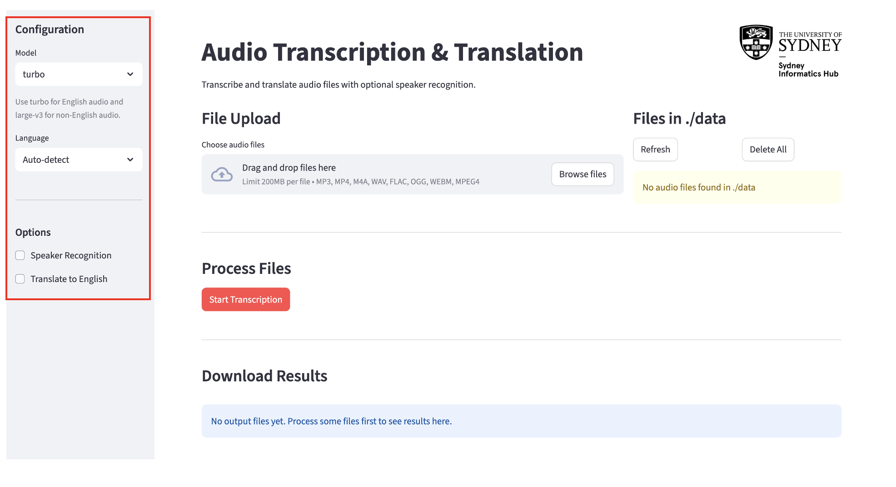

### Model

Choose the Whisper model to use for transcription:

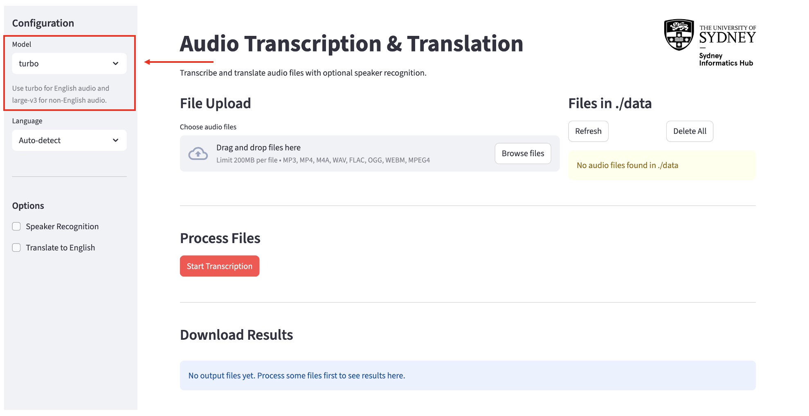

- **`turbo`** *(default)* — use this for **English-only audio** when you want faster processing.
- **`large-v3`** — use this for **non-English audio**, or when you need the highest accuracy. Slower but more powerful.

### Language

Select the language spoken in your audio files.

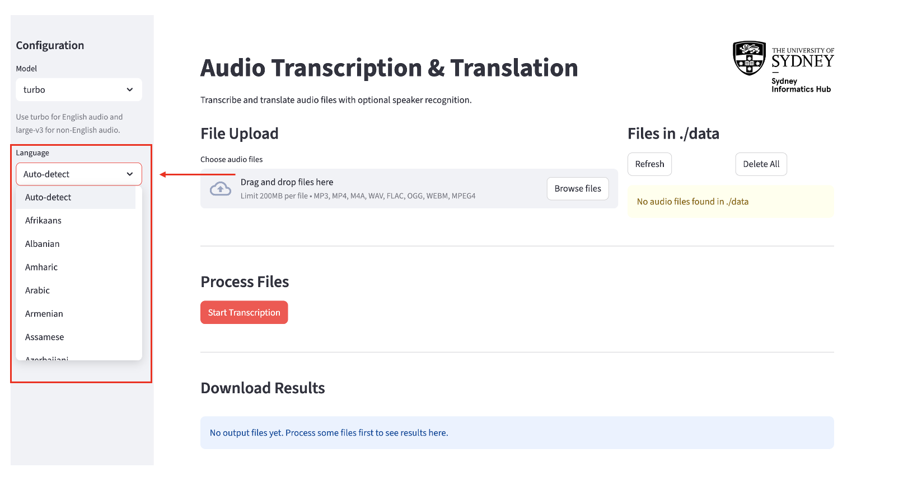

- **Auto-detect** *(default)* — the model will guess the language automatically. Works well in most cases.
- If you **know** the language, select it from the dropdown. This is more accurate than auto-detect and recommended when processing non-English audio.

### Options

**Speaker Recognition**

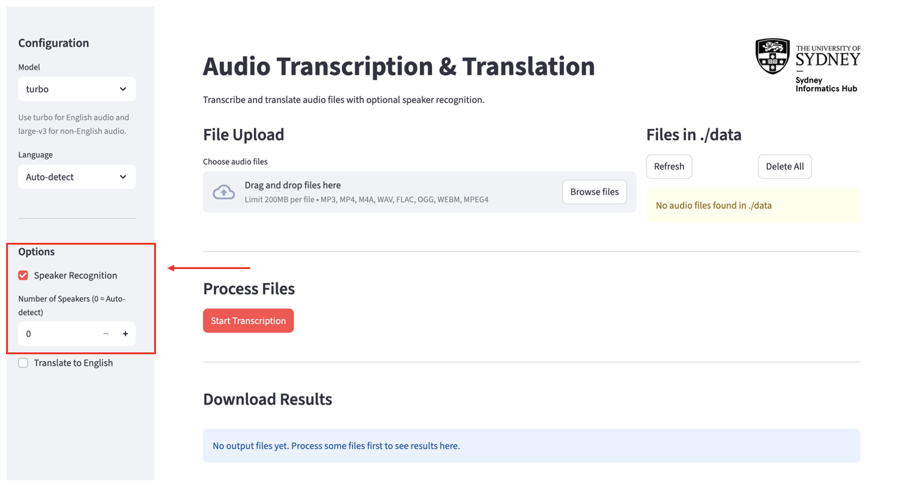

- Check this box if your audio contains **multiple speakers** and you want the transcript to identify who said what (e.g. "SPEAKER_01: Hello").
- When enabled, a **Number of Speakers** field appears:
    - Enter `0` to let the app auto-detect how many speakers there are.
    - Enter the exact number of speakers (e.g. `2`) for **more accurate** results. Use this whenever you know how many people are in the recording.
    - Maximum supported: 20 speakers.

**Translate to English**

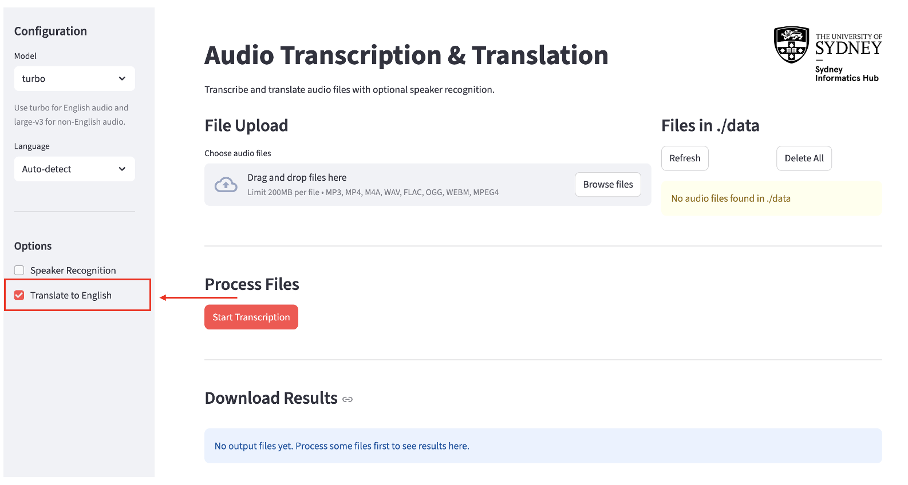

- Check this box if you want the output translated into English, regardless of the source language.
- Can be combined with Speaker Recognition — the transcript will show speaker labels and English text together.

---

## Step 2: Upload Your Audio Files

Supported formats: **MP3, MP4, M4A, WAV, FLAC, OGG, WEBM**

1. In the **File Upload** section, click **Upload**.

    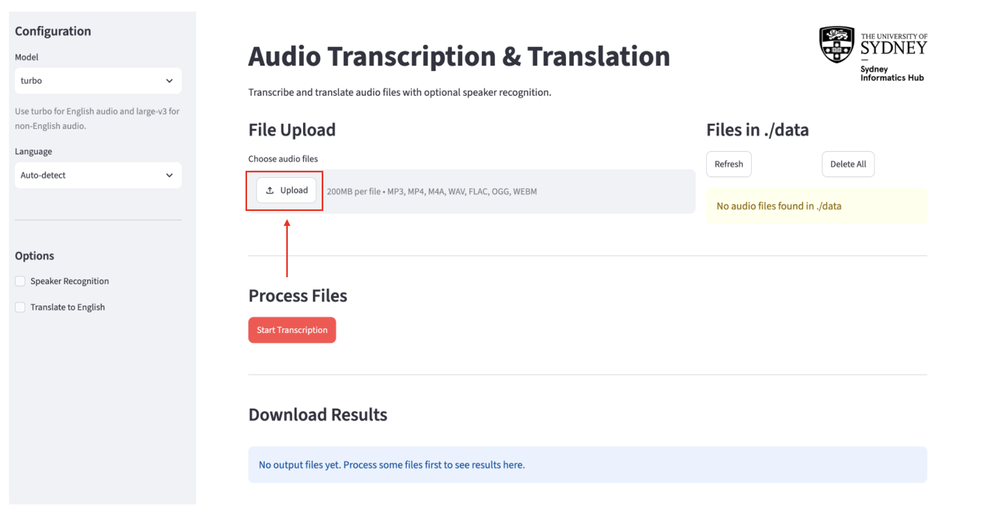

2. You can select **multiple files** at once.

The **Files in ./data** panel on the right shows everything currently queued for processing. From here you can:

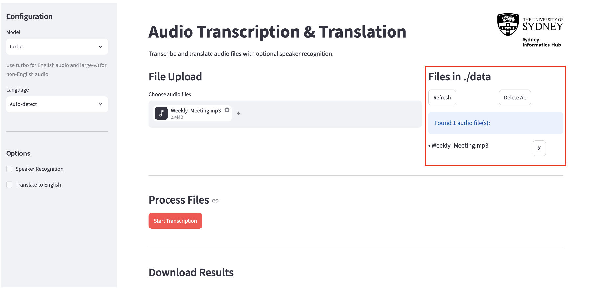

- Click **Refresh** to update the list.
- Click **X** next to a file to remove it individually.
- Click **Delete All** to clear every file in the queue.

---

## Step 3: Run Transcription

Once your files are uploaded and your settings are configured, click the **Start Transcription** button.

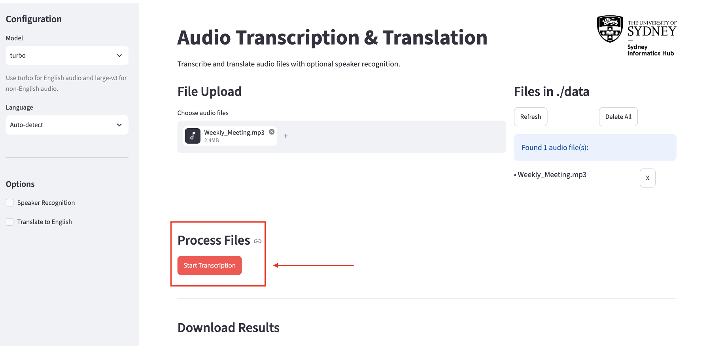

- A progress bar and status message will appear showing which file is being processed and how many remain.
- Logs appear at the bottom of the page in real time.
- Processing time depends on file length, the model chosen, and whether speaker recognition is enabled.

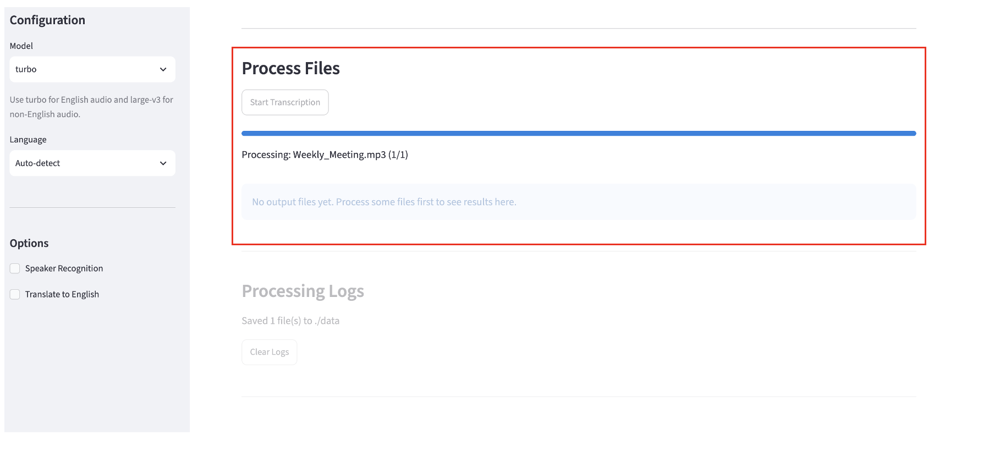

!!! note
    Do not change settings or navigate away while processing is running.

---

## Step 4: Download Results

When processing finishes, the **Download Results** section shows your output files.

- **Download All (ZIP)** — downloads a `transcriptions.zip` archive containing your results:
    - `.srt` and `.txt` files for your output
    - if translation was used, the transcription in the original language as well as the translated English file
    - a `reference.txt` file with a research blurb and methodology

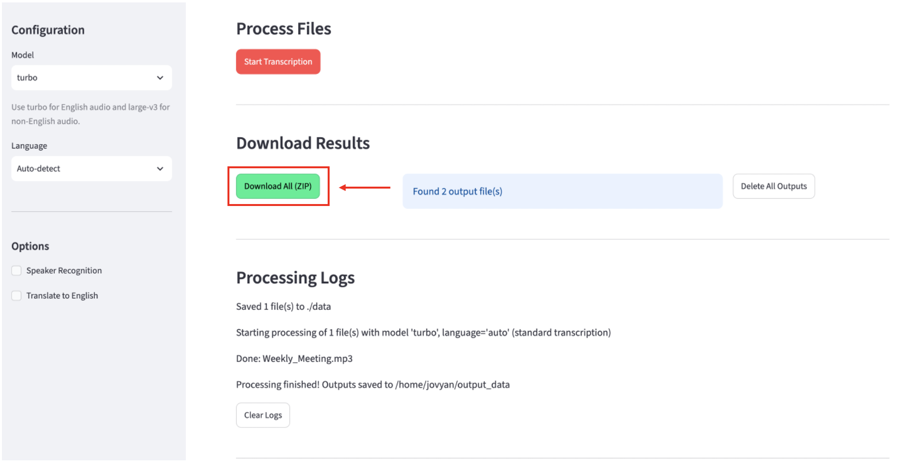

- Click **Delete All Outputs** to remove all output files.

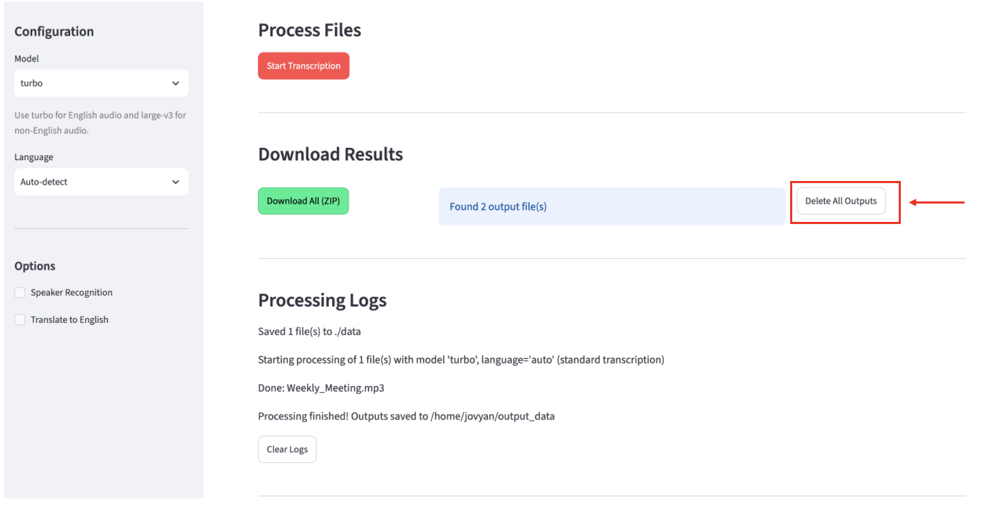

---

## Processing Logs

The **Processing Logs** section at the bottom records what happened during each run — which files were processed, any errors, and when processing completed.

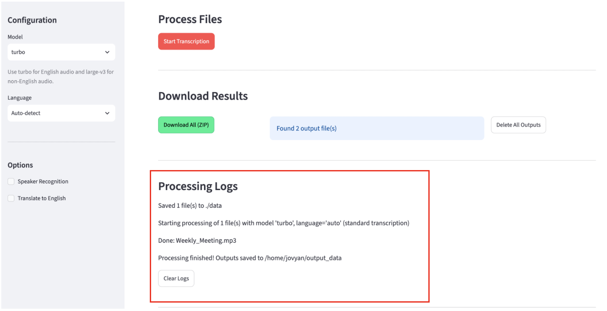

Click **Clear Logs** to reset the log view.

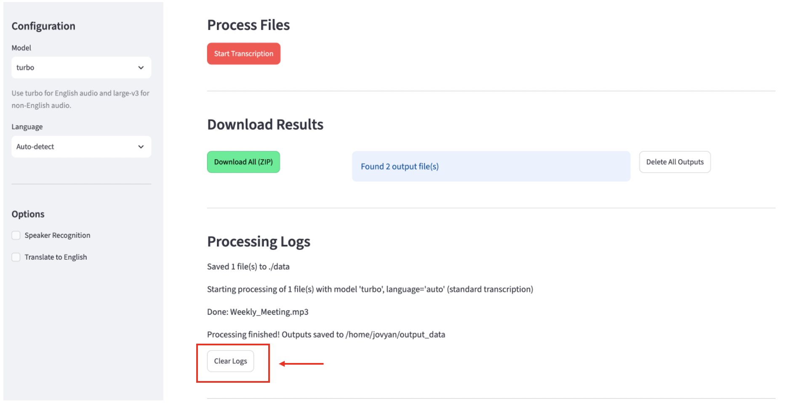

---

## Quick Reference

| Goal | Settings |
|---|---|
| Transcribe English audio, fast | Model: `turbo`, Language: `English` |
| Transcribe non-English audio | Model: `large-v3`, Language: select yours |
| Identify speakers in a recording | Enable **Speaker Recognition**; set number of speakers if known |
| Get an English translation of foreign audio | Enable **Translate to English** |
| Transcribed translation with speaker labels | Enable both **Speaker Recognition** and **Translate to English** |
