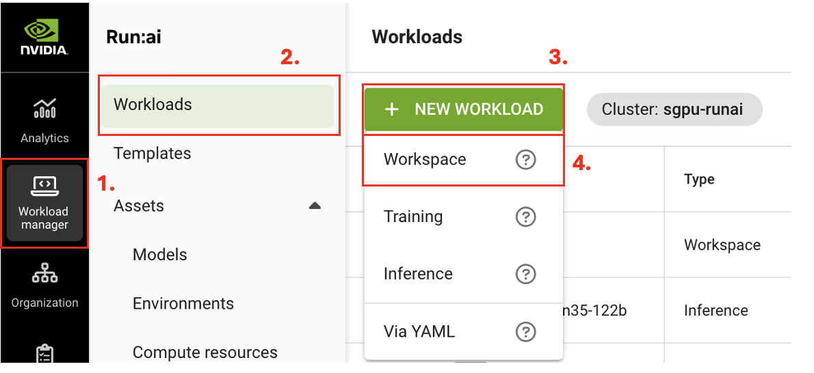
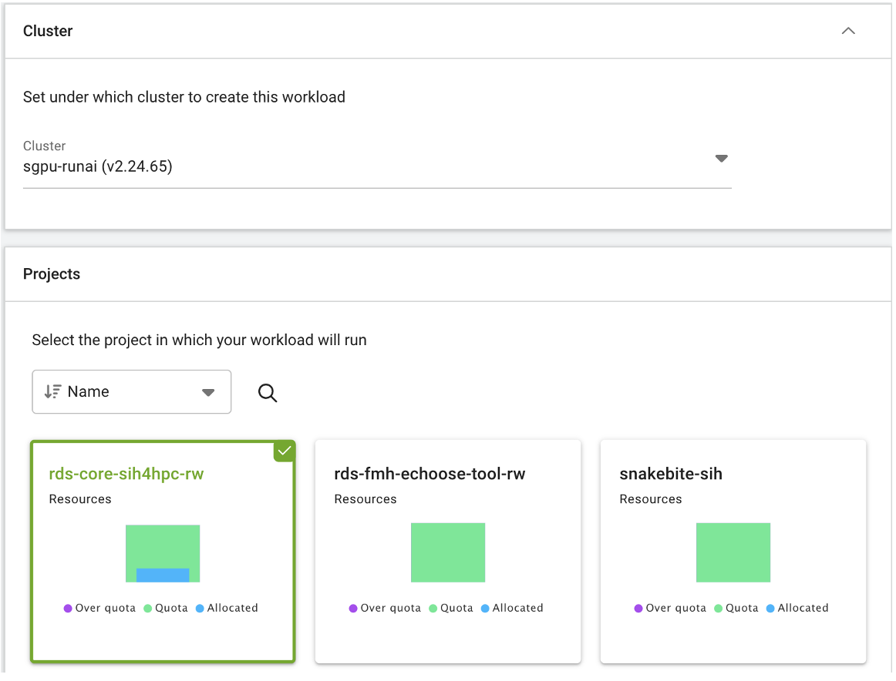
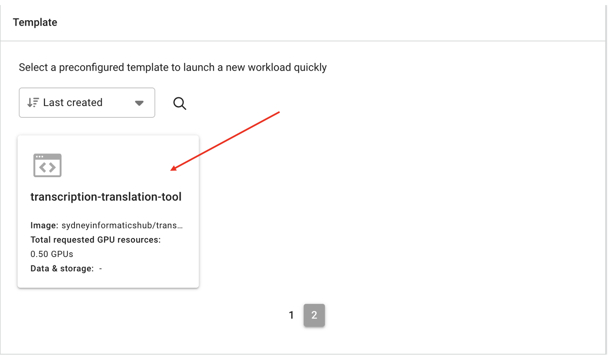
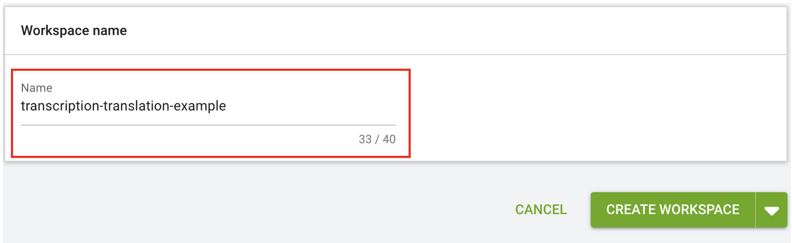
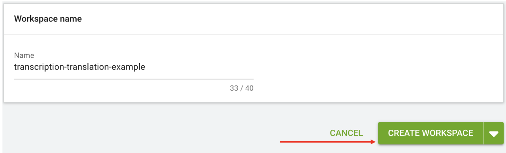
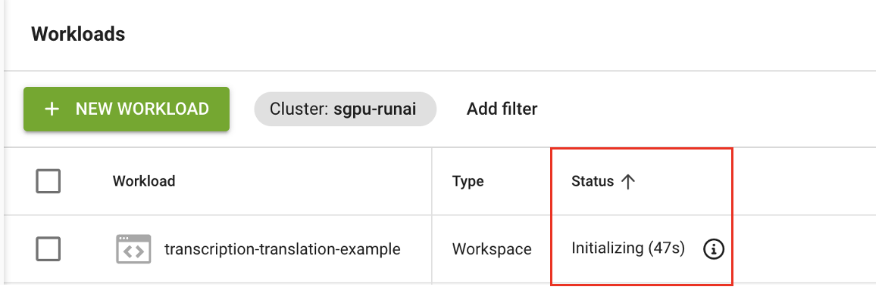
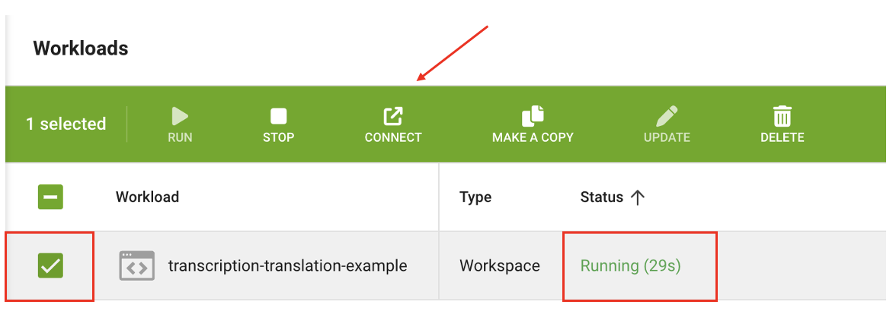

# Audio Transcription & Translation — Apollo Guide

## Creating a Workload

Step 1: Create a workload

1. Navigate to the "Workload manager" section.
2. Select "Workloads".
3. Click the "NEW WORKLOAD" button.
4. Select "Workspace" from the dropdown menu.

    

Step 2: Configure the workload

1. The "Cluster" section will be set automatically; you do not need to change this.
2. Under "Projects", select the project it will be linked to (yours will differ from the examples in the image below depending on your project).

    

3. Under "Templates", select "transcription-translation-tool". It may not appear on the first page, so use the page numbers at the bottom to navigate through the list.

    

4. Provide a descriptive name for the workload (e.g. transcription-translation-example).

    

5. Finally select "CREATE WORKSPACE".

    

6. You will now be taken back to the Run:ai Workloads page.

Step 3: Connect to the Transcription and Translation app

1. Your workload status will start on "Initializing". This may take a couple of minutes.

    

2. When the status changes to "Running," select your workload. You can then access the transcription and translation app interface by selecting "Connect."

    

3. The transcription and translation app will now open in a separate tab in your browser.

For instructions on how to use the app, see the [App user guide](transcription_app_guide.md).
