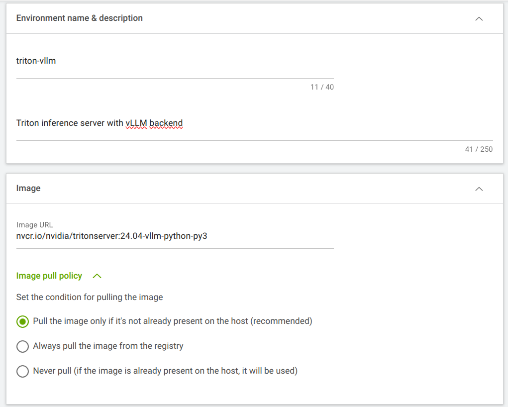
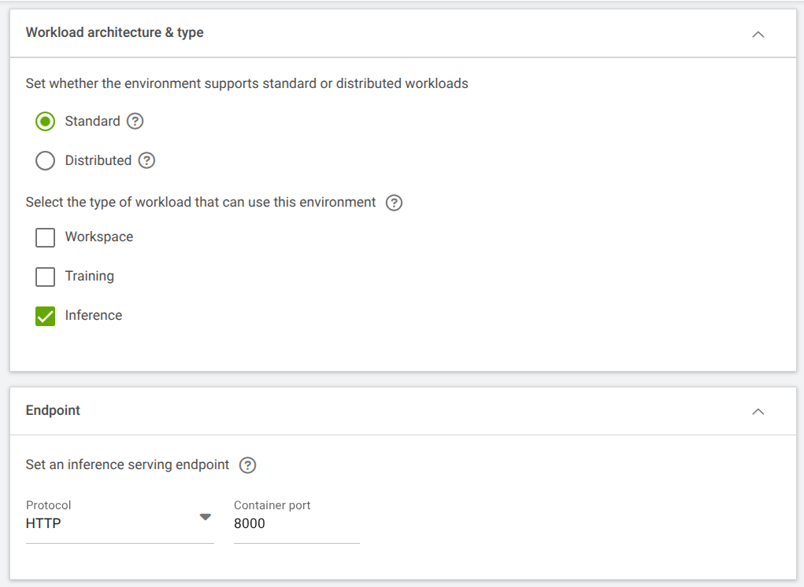
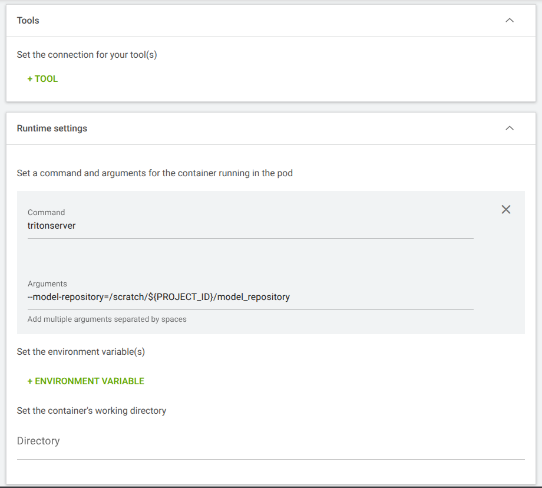
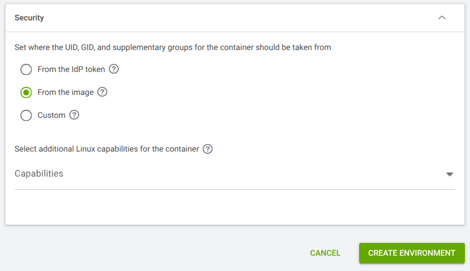
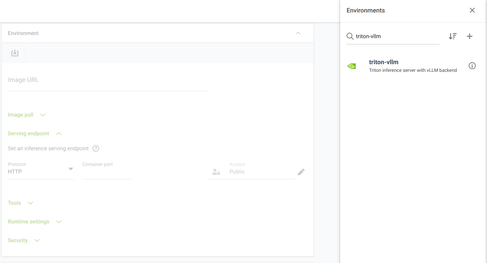
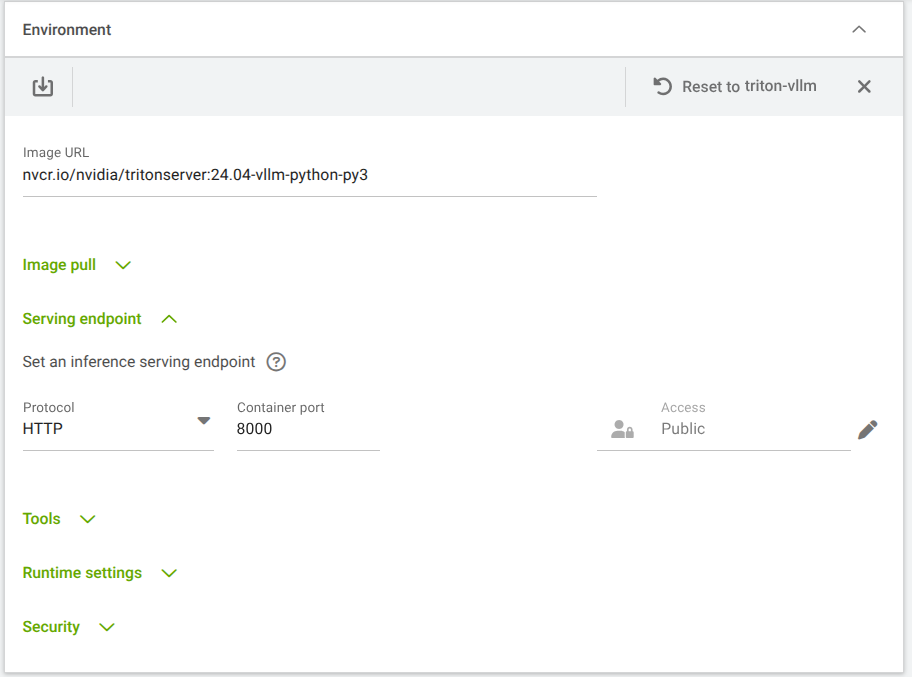
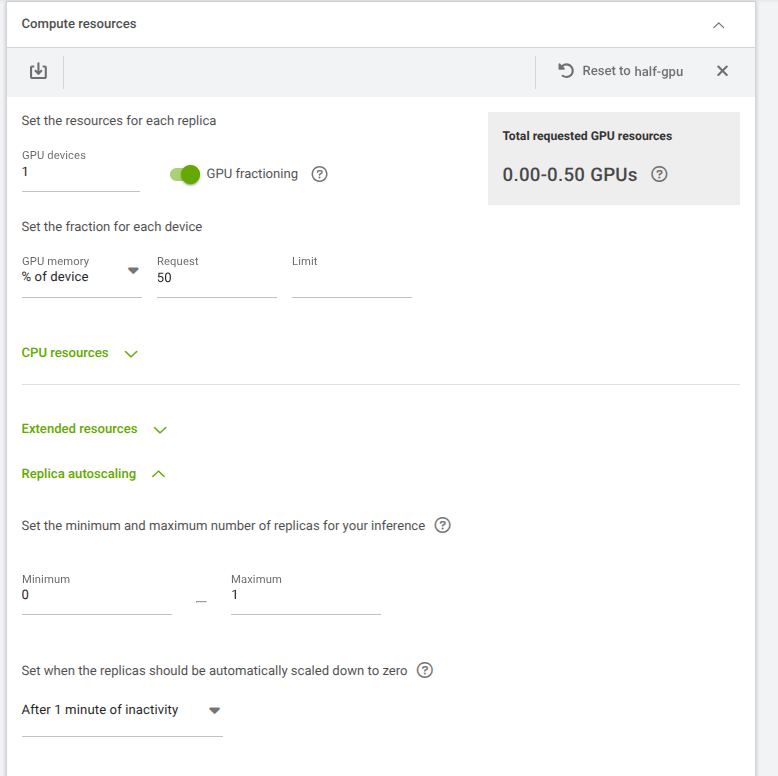
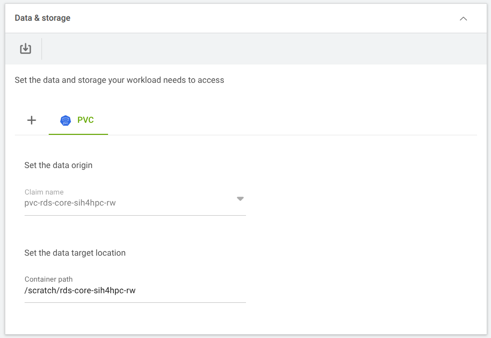

Running a large model directly inside a Jupyter notebook works for quick experiments, but it keeps the GPU occupied for as long as your notebook is open, even when you're not actively using the model. A dedicated inference server changes this: your notebook (or a web interface built in tools like [Marimo](marimo_tutorial.md) or Gradio) sends requests to the server over the network, and the GPU is only engaged while those requests are being processed. **This makes cluster usage more efficient for your whole research group and keeps your analysis code separate from the model serving layer.**

[NVIDIA Triton Inference Server](https://docs.nvidia.com/deeplearning/triton-inference-server/user-guide/docs/index.html) is a widely-used open-source tool for this purpose. In this tutorial we use Triton with the [vLLM](https://docs.vllm.ai/en/latest/) backend, which is optimised for large language models and handles memory management and request batching automatically. This is useful for text-based research tasks such as literature summarisation, annotation, or question-answering over scientific documents.

## What you will learn

By the end of this tutorial you will have:

- Launched a Jupyter notebook on the cluster
- Downloaded a model from [HuggingFace](https://huggingface.co) to the cluster's shared storage
- Created a Triton Inference Server environment in [Run.ai](https://run-ai-docs.nvidia.com/self-hosted/2.22/workloads-in-nvidia-run-ai/using-inference/quick-starts/inference-quickstart)
- Connected to the server and confirmed it is live
- Listed the models the server is serving

**Prerequisites:**

- Access to an active Run.ai project
- A persistent volume claim (PVC) mounted at `/scratch/YOUR_PROJECT_ID/` - your project's shared network drive where data and models are stored

---

## Step 1: Launch a Jupyter notebook

We will use a Jupyter notebook to prepare the model and later interact with the Triton server. Follow the [Jupyter Lab tutorial](jupyter_tutorial.md) to start a notebook workload if you do not already have one running.

Once the notebook is running, open a new terminal from the Jupyter Lab launcher.

## Step 2: Create a model repository directory

Triton reads models from a *model repository* - this is simply a dedicated directory on your PVC. We store models on the PVC rather than inside the notebook container because the PVC persists between sessions and is accessible to all workloads in your project. This means you download a model once and reuse it across analyses without re-downloading.

In the Jupyter terminal, run:

```bash
mkdir -p /scratch/YOUR_PROJECT_ID/model_repository
cd /scratch/YOUR_PROJECT_ID/model_repository
```

## Step 3: Authenticate with HuggingFace

[HuggingFace](https://huggingface.co) hosts thousands of open LLMs trained for different use cases. Many require a free account to download. Install the [HuggingFace CLI](https://huggingface.co/docs/huggingface_hub/en/guides/cli):

```bash
python -m venv .venv # create this in a "scratch" or "work" folder on the PVC
source .venv/bin/activate # activate the venv

pip install -U huggingface_hub
```

Next, create a read-scoped access token:

1. Go to [https://huggingface.co/settings/tokens](https://huggingface.co/settings/tokens)
2. Click **New token**
3. Set the scope to **Read** and give it a name such as `triton-download`
4. Copy the token value — it will only be shown once

Save the token to a file and **restrict its permissions so only your user account can read it**:

```bash
echo "hf_your_token_here" > .hf-token
chmod 600 .hf-token
```

Authenticate the CLI:

```bash
hf auth login --token $(cat .hf-token)
```

You should see:

```bash
Token is valid (permission: read).
Login successful.
```

## Step 4: Download a model to the PVC

For this example, we will use `facebook/opt-125m`, a small general-purpose language model well-suited for testing your setup before moving to larger specialist models.

Before downloading, we recommend running `--dry-run` first to see the total size without transferring any data:

```bash
hf download facebook/opt-125m \
  --local-dir /scratch/YOUR_PROJECT_ID/model_weights/opt-125m/ \
  --dry-run
```

The output lists every file and the total download size:

```bash
[dry-run] Fetching 12 files: 100%|██████████████████████████████████████████████| 12/12 [00:00<00:00, 25.70it/s]
Download complete: : 0.00B [00:00, ?B/s]              [dry-run] Will download 12 files (out of 12) totalling 753.1M.
File                    Bytes to download
----------------------- -----------------
.gitattributes          1.2K             
LICENSE.md              11.1K            
README.md               7.1K             
config.json             651.0            
flax_model.msgpack      250.5M           
generation_config.json  137.0            
merges.txt              456.3K           
pytorch_model.bin       250.5M           
special_tokens_map.json 441.0            
tf_model.h5             250.7M           
tokenizer_config.json   685.0            
vocab.json              898.8K           
Download complete: : 0.00B [00:00, ?B/s]
```

Although this is a small model for testing, we recommend checking that you have sufficient free space on your PVC before continuing when you use larger models.

Once satisfied, run the same command without `--dry-run`:

```bash
hf download facebook/opt-125m \
  --local-dir /scratch/YOUR_PROJECT_ID/model_weights/opt-125m/
```

The `--local-dir` flag saves files directly to the path you specify. Without it, HuggingFace defaults to a hidden cache directory (`~/.cache/huggingface/`) which can fill quickly on the cluster.

## Step 5: Configure the model

Triton does not load model weights directly. Instead, it reads from the model repository. This is a dedicated directory with a specific layout. Each model gets its own subdirectory containing a configuration file and a version folder. Weights are stored separately and pointed to from within that configuration.

Create the directory layout for `opt-125m`:

```bash
mkdir -p /scratch/YOUR_PROJECT_ID/model_repository/opt-125m/1
```

You now need to create two small configuration files.

### `config.pbtxt`: tells Triton how to serve the model

Create `/scratch/YOUR_PROJECT_ID/model_repository/opt-125m/config.pbtxt`:

```protobuf
backend: "vllm"

instance_group [
  {
    count: 1
    kind: KIND_MODEL
  }
]
```

* `backend: "vllm"` selects the vLLM serving engine. `instance_group` controls how many copies of the model to run.
* `count: 1` with `kind: KIND_MODEL` means one instance on the GPU. For most single-GPU research use cases this is the right setting. See the [Triton model configuration reference](https://docs.nvidia.com/deeplearning/triton-inference-server/user-guide/docs/user_guide/model_configuration.html) for other options.

### `model.json`: tells vLLM which model to load and how

Create `/scratch/YOUR_PROJECT_ID/model_repository/opt-125m/1/model.json`:

```json
{
    "model": "/scratch/YOUR_PROJECT_ID/model_weights/opt-125m",
    "gpu_memory_utilization": 0.4,
    "enforce_eager": true
}
```

- `model`: the path to the downloaded weights. This can also be a HuggingFace model ID (e.g. `"facebook/opt-125m"`) if you want vLLM to download at startup rather than from a local copy.
- `gpu_memory_utilization`: the fraction of GPU memory vLLM may use. `0.4` (40%) leaves headroom for request processing and other workloads sharing the GPU. Increase this if you see out-of-memory errors with larger models.
- `enforce_eager`: disables CUDA graph optimisation. This makes startup slower but uses less memory, which is useful on shared or fractioned GPUs. Set to `false` for better throughput once your setup is working.

Any parameter accepted by vLLM's engine arguments (such as `max_model_len` to cap context length, or `tensor_parallel_size` for multi-GPU) can be added here. See the [vLLM engine arguments reference](https://docs.vllm.ai/en/latest/serving/engine_args.html).

Your model repository should now look like this:

```bash
/scratch/YOUR_PROJECT_ID/
├── model_weights/
│   └── opt-125m/          ← downloaded weights
└── model_repository/
    └── opt-125m/          ← Triton model entry
        ├── config.pbtxt
        └── 1/
            └── model.json
```

::: {.callout-note}
The `1/` subdirectory represents version 1 of your model. Triton supports multiple versions: if you update the weights later, add a `2/` directory alongside `1/` without removing the old one. By default, Triton serves the latest version.
:::

::: {.callout-warning}
Triton treats every subdirectory inside `model_repository/` as a model and will fail to start if any of them is not a valid model entry. Two common causes: placing your weights directory inside `model_repository/` by mistake, or Jupyter creating a hidden `.ipynb_checkpoints` folder there if you open the directory in a notebook. If the server fails to start, check for unexpected subdirectories and remove them.
:::


## Step 6: Create a Triton server environment

An *environment* in Run.ai packages the container image and runtime configuration needed to launch a workload. We create one that uses the official Triton image with the vLLM backend.

Navigate to **Environments** in the Run.ai UI and click **New Environment**. Under **Environment name & description**, enter:

| Field | Value |
|---|---|
| Environment name | `triton-vllm` |
| Description | `Triton inference server with vLLM backend` |

Under **Image**, enter:

| Field | Value |
|---|---|
| Image URL | `nvcr.io/nvidia/tritonserver:24.04-vllm-python-py3` |
| Image pull policy | Pull the image only if it's not already present on the host |

{fig-alt="Run.ai New Environment form with triton-vllm name and nvcr.io image URL filled in." width="80%"}

Under **Workload architecture & type**, select **Standard** and tick **Inference**. Under **Endpoint**, set the protocol to **HTTP** and the container port to **8000**.

{fig-alt="Workload architecture set to Standard and Inference, with HTTP endpoint on port 8000." width="80%"}

Under **Runtime settings**, enter:

| Field | Value |
|---|---|
| Command | `tritonserver` |
| Arguments | `--model-repository=/scratch/${PROJECT_ID}/model_repository` |

This tells Triton where to find models when it starts. The `${PROJECT_ID}` variable is automatically resolved to your project name by Run.ai.

{fig-alt="Runtime settings with tritonserver command and --model-repository argument pointing to the PVC." width="80%"}

Under **Security**, select **From the image**, then click **Create Environment**.

{fig-alt="Security set to From the image with the Create Environment button visible." width="80%"}

## Step 7: Launch a Triton inference workload

Go to **Workloads** and create a new **Inference** workload. Enter the following:

| Field | Value |
|---|---|
| Projects | Select your project |
| Template | Start from scratch |
| Inference type | Custom |
| Inference name | `triton-vllm` |

Select **Continue**.

Under **Environment**, select **Load from existing setup** and choose `triton-vllm`. This populates the environment configuration from the previous step.

{fig-alt="Run.ai workload environment panel with triton-vllm selected from the list." width="80%"}

{fig-alt="Workload environment section populated with the triton-vllm configuration." width="80%"}

Under **Compute resources**, select **Load from existing setup** and choose `half-gpu`. This preset allocates 50% of one GPU's memory using GPU fractioning, which lets the GPU be shared with other workloads rather than reserved exclusively for this server.

Expand **Replica autoscaling** and confirm it is set to a minimum of **0** and a maximum of **1**, with scale-down triggered **after 1 minute of inactivity**. With minimum replicas set to 0, the server releases the GPU entirely when no requests are being made and spins back up automatically when the next request arrives. This frees up GPU resources for other researchers when the server is idle.

{fig-alt="Compute resources with half-GPU fractioning and autoscaling configured to scale to zero when idle." width="80%"}

Under **Data & storage**, attach your project PVC and confirm the container path matches the mount point your project uses (e.g. `/scratch/YOUR_PROJECT_ID`). This gives the Triton server access to the model repository directory you created in Step 2.

{fig-alt="Data and storage panel with the project PVC mounted at the scratch path." width="80%"}

Select **Create inference**. Wait until the workload status shows **Running** before continuing.

## Step 8: Install the Triton HTTP client

Back in your Jupyter notebook, install the Triton client library:

```python
%pip install tritonclient[http] requests
```

## Step 9: Connect to the server

The Triton server is reachable from within the cluster using its internal DNS address. This is a name automatically assigned by the cluster so that workloads can find each other without needing to be exposed to the internet.

In a new notebook cell, run:

```python
import tritonclient.http as httpclient

TRITON_URL = "triton-vllm.runai-YOUR_PROJECT_ID.svc.cluster.local"
# Replace YOUR_PROJECT_ID with your Run.ai project name.
# Find the full address in the Run.ai UI under the workload's details page.

client = httpclient.InferenceServerClient(url=TRITON_URL, verbose=True)

print("Server:", client.is_server_live())
print("Ready:", client.is_server_ready())
print("Available models:", client.get_model_repository_index())
```

A successful response looks like this:

```python
Server: True
Ready: True
Available models: [{'name': 'opt-125m', 'version': '1', 'state': 'READY'}]
```

## Step 10: Send your first inference request

With the server confirmed live and the model ready, you can now send a prompt and receive a completion.

The `tritonclient.http` client handles server management (health checks, model listing), but for inference with the vLLM backend we use Triton's **generate endpoint** via the standard `requests` library.

The generate endpoint (`POST /v2/models/{model_name}/generate`) is a REST extension designed for LLM inference. It accepts a JSON body with a `text_input` field and an optional `parameters` block, and returns a JSON response with a `text_output` field. Unlike the standard `client.infer()` call, it handles Triton's internal streaming protocol transparently, so you get a simple request-response interaction over plain HTTP.

Define a helper function in a new notebook cell:

```python
import requests

def generate(model_name, prompt, max_tokens=10, **kwargs):
    # Uses the Triton generate HTTP endpoint
    response = requests.post(
        f"http://{TRITON_URL}/v2/models/{model_name}/generate",
        json={
            "text_input": prompt,
            "parameters": {"max_tokens": max_tokens, **kwargs}
        }
    )
    response.raise_for_status()
    return response.json()["text_output"]
```

- `model_name`: must match the subdirectory name you created in Step 5 (e.g. `"opt-125m"`).
- `max_tokens`: the maximum number of new tokens to generate. Keep this small while testing.
- `**kwargs`: any additional vLLM parameter is passed through directly, such as `temperature` to control randomness (0 = deterministic, 1 = more varied).

Now send some requests:

```python
msg = "Triton inference server is"

generate("opt-125m", prompt=msg)
# 'Triton inference server is a Python based inference library. The Mobileathef'

generate("opt-125m", prompt=msg, temperature=0.8)
# 'Triton inference server is designed to provide a visual representation of the model by'

generate("opt-125m", prompt=msg, max_tokens=20, temperature=0.4)
# 'Triton inference server is a set of tools that are used to perform Triton inference. It is a set of tools'
```

The model is completing your prompt. `opt-125m` is a small general-purpose model so output quality is limited - this is expected.

You now have a working Triton Inference Server serving a model from your project's shared storage and responding to inference requests!