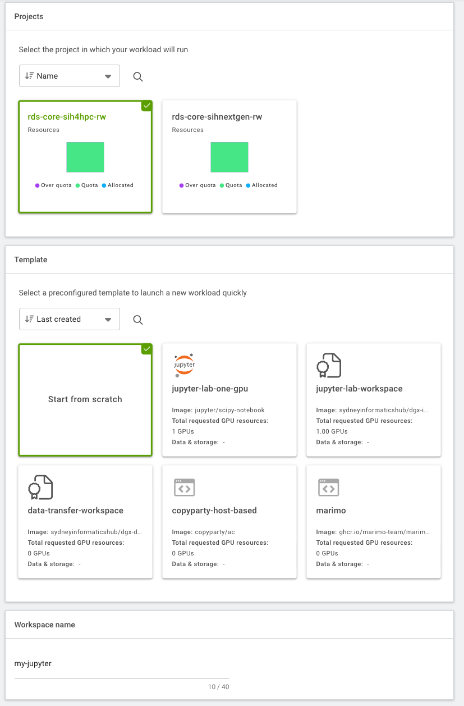
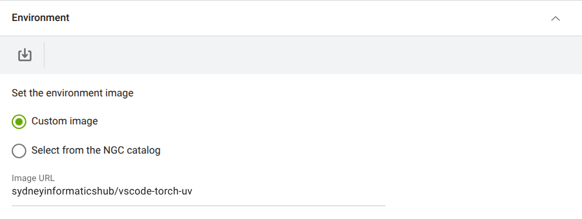
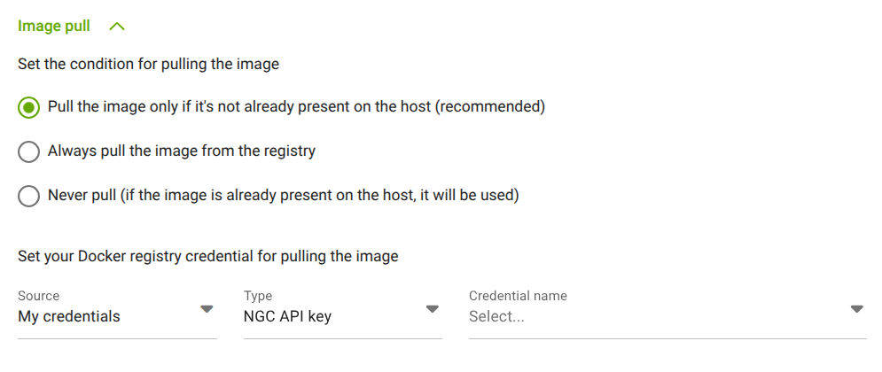
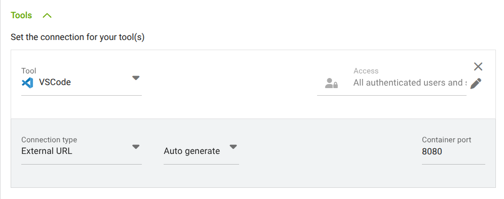
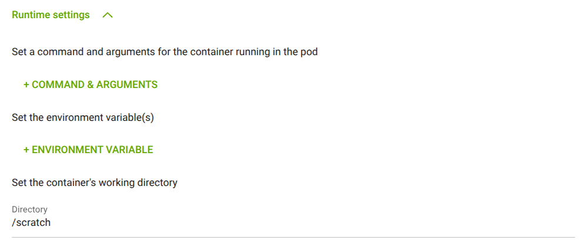
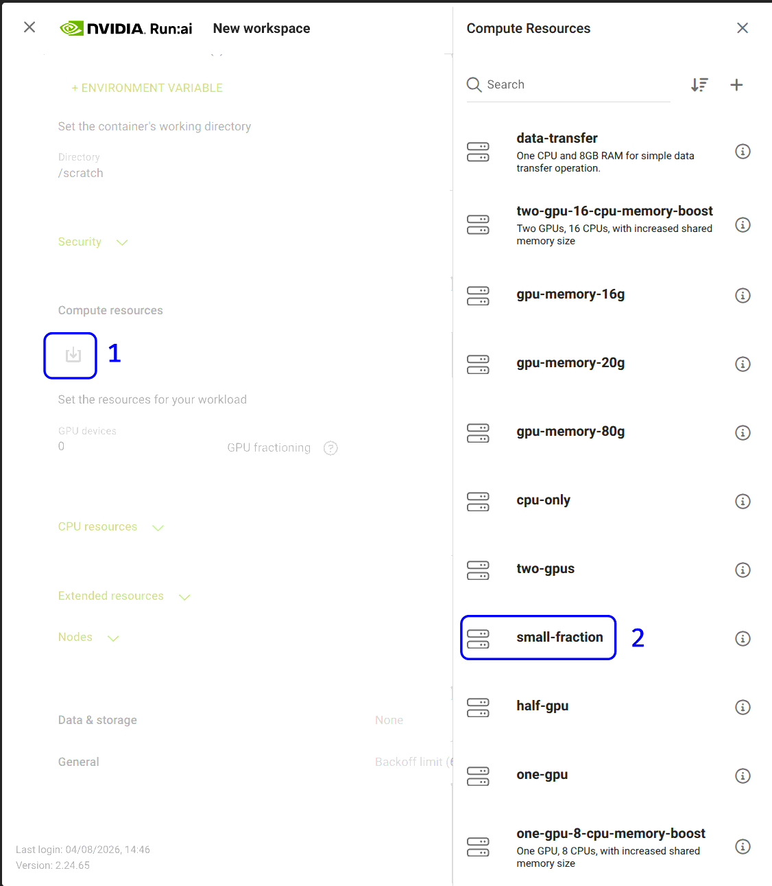
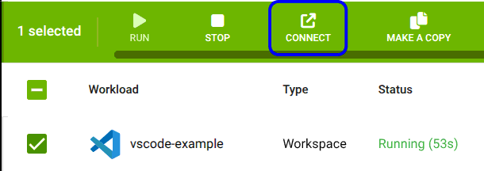
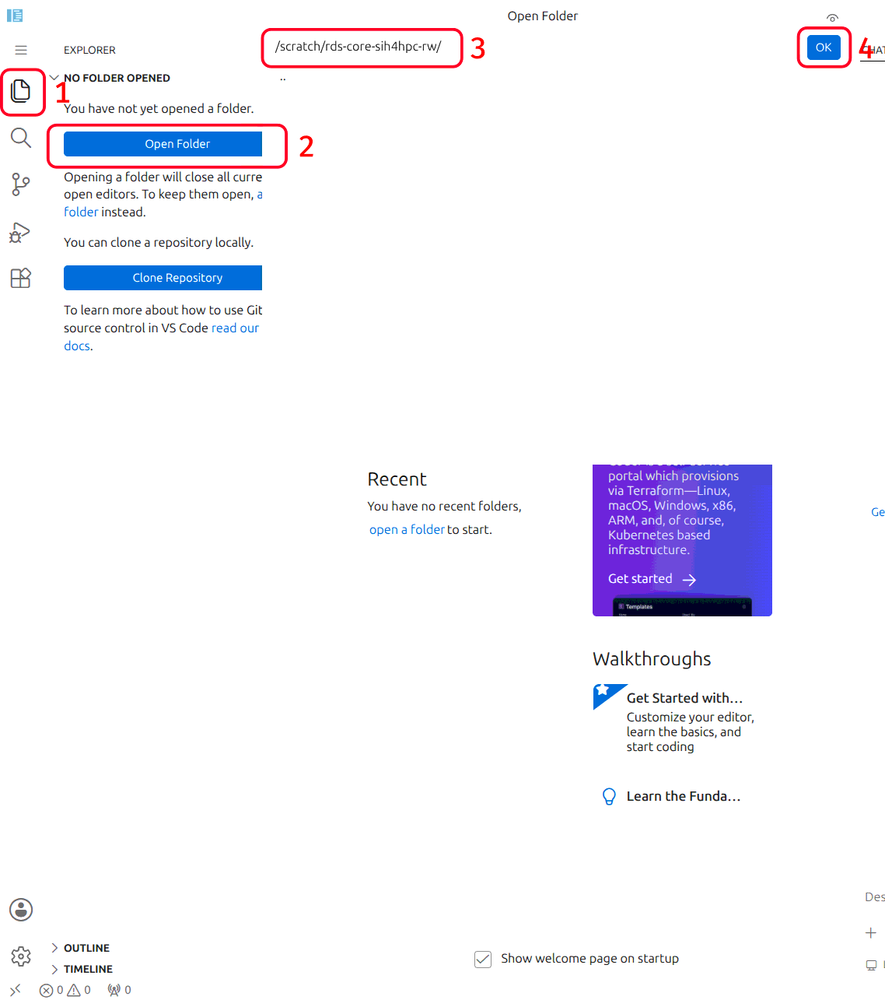

# Tutorial: Running a VS Code Workload with PyTorch

A workload is the actual job or task you want to run on the platform. This could be training an AI model, and running an inference model and exposing its endpoint, doing data preprocessing, or conducting a scientific simulation.

Generally, the minimum requirements you need before creating the workload include:

* Being granted permission to an [active project](runai_features.md#runai-projects)
* An [environment](runai_features.md#runai-environments) to run such job
* Have a [data source](runai_features.md#runai-data-sources), e.g. a PVC, to store your input and output data
* Understand the [compute resources](runai_features.md#runai-compute-resources) requirements you need to run the job

In this tutorial, we will create a VS Code workload that allows you to run the VS Code IDE interactively on the SIH GPU cluster. We will use a pre-packaged container that contains PyTorch already installed.

## Step 1: Create a workload
Navigate to the "Workload manager" section, select "Workloads", and click on the "NEW WORKLOAD" button. Select "Workspace" from the dropdown menu.


## Step 2: Configure the workload from scratch
Define the necessary information for your workload:

* The "Cluster" section will be set automatically, you do not need to change this
* Under "Projects" select the project it will be linked to
* Under "Templates" select "Start from scratch" (*i.e.* do not use any existing template)
* Provide a descriptive name for the workload

    

* Under "Environment", copy and paste `sydneyinformaticshub/vscode-torch-uv` into the "Image URL" field. This environment pulls a [pre-built image](https://hub.docker.com/r/sydneyinformaticshub/vscode-torch-uv/tags) that has VS Code, python, PyTorch (and their dependencies) installed. `uv` also comes pre-installed to efficiently manage and download any packages not included in this container.

    

* Under "Image pull", select "Pull the image only if it's not already present on the host (recommended)"

    

* Click "Tools" to expand this section then select "+ TOOL". Under the "Tool" field, select "VSCode" and leave the remaining options as defaults.

    

* Open the "Runtime settings" section, and "Set the container's working directory" as "/scratch".

    

* Under "Compute resources", select the amount of compute resources to run the workload. In this tutorial, we will select the `small-fraction` option that requires 1 H200 GPU with 10% of its memory (~14GB). Depending on the actual workload you're running, this option can be adjusted accordingly.

    

    Each compute resource option is a preset that bundles GPU, CPU, and memory together, so you don't need to separately configure CPU or memory - these are already set appropriately for the selected option.

    **Tip:** For interactive development and initial prototyping, we recommend using a fractional GPU option (like `small-fraction`) rather than a full GPU. This reduces idle GPU time and compute costs, since interactive coding rarely needs a full GPU's worth of memory. Switch to a larger allocation once you're ready to run full-scale jobs.

* Click "Data & sources" to expand this section and configure the data source to be mounted to the container. Here we select the default PVC created for the project. The mount path inside the container is set to `/scratch/<runai-project-name>`.


    

* Finally, click on "CREATE WORKSPACE" to submit the workload to the cluster. The workspace can take a few minutes to initialise.

## Step 3: Connect to VS Code

When the status changes to "Running", you can access the VS Code interface by selecting the VSCode workload and selecting "CONNECT" in the top menu bar.



We recommend opening your scratch folder so you have direct access to your project's data and files:

* Click the file icon in the left sidebar, then click "Open Folder"
* Enter `/scratch/<runai-project-name>` in the field (replace `<runai-project-name>` with your own project's name, shown in Run:ai - in the example below this is `rds-core-sih4hpc-rw`)
* Click "OK"

    

## (Optional) Using `uv` for dependency management

[`uv`](https://docs.astral.sh/uv/) is a fast, drop-in replacement for tools like `pip` and `conda`. Unlike `conda`, which can take a long time to resolve and install packages, `uv` installs packages (and resolves their dependencies) much faster, so you spend less time waiting and more time working. It's also simpler: you don't need to create and manage separate `conda` environments, since the container you are running already comes with Python, PyTorch, and their dependencies pre-installed.

To install any additional packages you need without re-downloading PyTorch or its dependencies, avoid creating a new virtual environment where possible and instead install packages directly, e.g.:

```bash
uv pip install --system <package-name>
```

This installs into the container's existing Python environment, reusing the pre-installed PyTorch. If you do need an isolated virtual environment (e.g. to avoid conflicting package versions), create it with access to the pre-installed system packages instead of starting from scratch:

```bash
uv venv --system-site-packages
source .venv/bin/activate
```

This lets the new environment see the pre-installed PyTorch, so you only need to `uv pip install` the extra packages your workload requires.

For more information, see:

* https://docs.astral.sh/uv/concepts/projects/
* https://docs.astral.sh/uv/reference/cli/#uv-venv--system-site-packages
